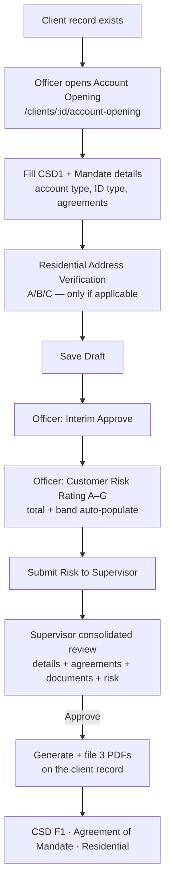

# Account Opening Workflow (Internal + Self-Service)

This document describes the **client account-opening** feature: the two statutory
forms (CSD F1 + Agreement of Mandate), the Residential Address Verification form,
the Customer Risk Rating, and the officer → supervisor approval chain that
produces the final, filed PDFs on the client record.

It applies whether the account is set up **internally** by staff or started by the
**client** through the portal — the self-service path captures intake + uploads,
and staff run the same internal workflow to completion.

---

## 1. Overview



Status progression: `Draft → InterimApproved → PendingSupervisor → Approved`.

---

## 2. Storage

The workflow is **file-system only** (no DB table) — one JSON document per client:

```
/uploads/client-attachments/{clientId}/account-opening.workflow.json
```

The generated PDFs are written into the same client folder (so they appear in the
client's **Documents** section) using the existing attachment naming convention
`{guid}__{name}.pdf`:

| File | Source form |
|---|---|
| `…__CSD1-Form.pdf` | Reserve Bank of Malawi **Securities Account Opening Form (CSD F1)** |
| `…__Client-Account-Opening-Form.pdf` | Cedar Capital **Agreement of Mandate — Private Client** |
| `…__Residential-Address-Verification-Form.pdf` | Residential Address Verification |

The upload root honours `Uploads:Root`; the default sits alongside
`client-attachments/`.

---

## 3. API

All routes are under `api/clients/{clientId:int}/account-opening` and require the
`clients` page permission (`[RequireArea(Clients)]` + `[RequirePage("clients")]`).

| Method + path | Purpose |
|---|---|
| `GET /` | Load the workflow (returns a fresh draft if none saved) |
| `GET /risk-catalog` | Cedar Customer Risk Rating catalog (Sections A–G options + bands) |
| `PUT /` | Save draft. Branch is forced to **Blantyre**; risk total/band recomputed server-side |
| `POST /interim-approve` | Officer interim approval → `InterimApproved` |
| `POST /submit-risk` | Submit the A–G risk rating → `PendingSupervisor` (requires interim approval) |
| `POST /supervisor-approve` | Supervisor approval → `Approved`; validates agreements + corporate docs, then generates + files the 3 PDFs |
| `GET /forms/csd1.pdf` | Download the CSD F1 PDF (preview any time) |
| `GET /forms/account-opening.pdf` | Download the Agreement of Mandate PDF |
| `GET /forms/residential-verification.pdf` | Download the Residential Address Verification PDF |

Server-enforced rules:

* **Branch** is always `Blantyre` (the only branch for now) — set on save and on
  every generated form.
* **Risk total + band** are always derived server-side from the catalog; the SPA's
  live total is for feedback only.
* **Interim approval** is required before a risk rating can be submitted.
* **Supervisor approval** requires interim approval + a risk rating + all
  mandatory client agreements, and (for corporates) the mandatory documents.

---

## 4. Account Types

Selected on the form (`accountType`):

| Type | Meaning | Extra capture |
|---|---|---|
| **Individual** | Single holder | — |
| **Joint** | More than one holder | `jointApplicants[]` — each with full name, ID document type, ID number, relationship |
| **ITF (In Trust For)** | Opened on behalf of another (e.g. a minor child) | `itfBeneficiary` — the beneficiary the account is held in trust for |

The **ID document type** is an explicit selector — **National ID** or **Passport**
(not a free-text "ID/Passport") — both on the primary applicant and per joint
holder. All joint applicants are listed (with signature lines) on the CSD F1.

---

## 5. Client Agreements (sign-off)

Captured as checkboxes and validated before supervisor approval:

| Flag | Meaning |
|---|---|
| `termsAccepted` | Terms and conditions agreed |
| `keyFactsAccepted` | Key Facts Statement acknowledged |
| `declarationAccepted` | Client declaration confirmed |
| `csdTermsAccepted` | CSD terms agreed |

---

## 6. Mandatory Documents

Uploaded through the client **Documents** section and checked at approval:

* **Individual** — the existing KYC set (ID, proof of address, source of funds).
* **Corporate** — enforced by `ValidateCorporateDocs`: **ID**, **Registration
  Certificate**, **Bank Statement**, **Memorandum**, **Board Minutes**. Approval
  is blocked with a clear message listing anything missing.

---

## 7. Residential Address Verification

Mirrors the Cedar form and is only completed when the customer does not live in
their own property and the utility is not in their name. Three sections:

* **A. Property Owner's Declaration** — owner first name / surname, plot number,
  location.
* **B. Residential Address Confirmation** — applicant full name, relationship to
  owner (Spouse / Tenant / Child / etc.), attached document type (Deed / utility
  bill / City rates bill / MHC bill).
* **C. Account Relationship Officer** — officer full name, date.

It is printable on demand and is one of the three PDFs filed at approval.

---

## 8. Customer Risk Rating (Sections A–G)

The officer ticks what applies; the total and band populate automatically. Each
option carries a preset score (High = 3 / Medium = 2 / Low = 1).

| Section | What it scores |
|---|---|
| **A** | Occupation / Nature of Business (42-item catalog) |
| **B** | Customer's Net Worth |
| **C** | Account Opening Process (face-to-face / combination / email) |
| **D** | Location (resides / registered) |
| **E** | Relationship (continuous / once-off) |
| **F** | Amount of Monthly Transactions |
| **G** | Number of Monthly Transactions |

**Overall band (Section H):** total `< 9` Low, `9–17` Medium, `> 17` High.

**Override:** any **High** in Section A, **or** a high-risk jurisdiction, classifies
the customer as **High** regardless of the total. When Section A is High the officer
is prompted to confirm senior-management approval, source-of-funds verification, and
enhanced due diligence.

The full A–G breakdown (and the override) is printed on the Agreement of Mandate PDF.

---

## 9. Approval Chain & Supervisor Review

1. **Officer** completes the forms, saves, and records an **interim approval**.
2. **Officer** completes the **risk rating** and submits it to the supervisor.
3. **Supervisor** sees a **consolidated, read-only review**: everything the client
   filled, the conditions agreed, the uploaded documents (inline), and the officer's
   A–G scoring.
4. On **approve**, the three PDFs are generated and filed on the client record, and
   the status becomes `Approved`. The forms are then downloadable from the client.

---

## 10. Code Map

| Concern | File |
|---|---|
| Workflow controller + endpoints | `brokerknow-api/src/BrokerKnow.Api/Controllers/ClientAccountOpeningController.cs` |
| Risk catalog (Sections A–G) | `brokerknow-api/src/BrokerKnow.Api/Controllers/AccountOpeningRiskCatalog.cs` |
| CSD F1 PDF | `brokerknow-api/src/BrokerKnow.Reports/Clients/Csd1FormPdf.cs` |
| Agreement of Mandate PDF | `brokerknow-api/src/BrokerKnow.Reports/Clients/ClientAccountOpeningWorkflowPdf.cs` |
| Residential Verification PDF | `brokerknow-api/src/BrokerKnow.Reports/Clients/ResidentialAddressVerificationPdf.cs` |
| Admin SPA — workflow page | `brokerknow-web/src/pages/Clients/ClientAccountOpeningPage.tsx` |
| Admin SPA — hooks / types | `brokerknow-web/src/data/hooks.ts` |

Source forms used as the format reference live in
`BK_Files/Docs/Acc-Opening/`.
