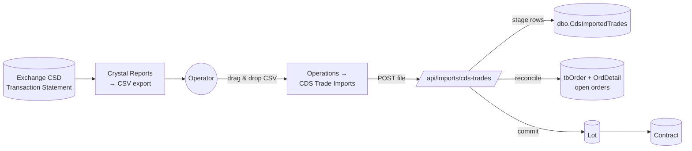
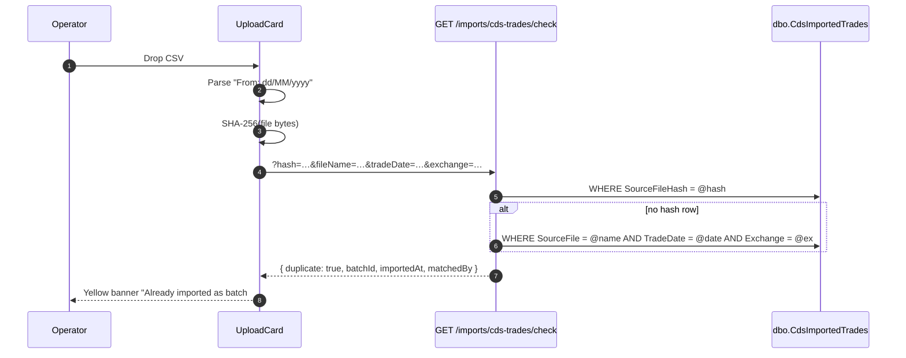
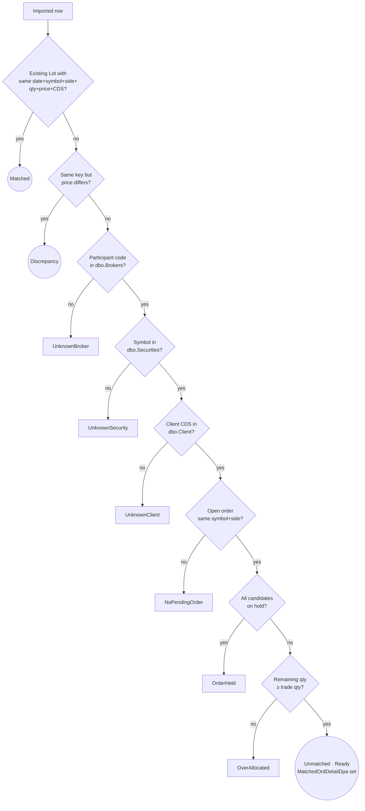
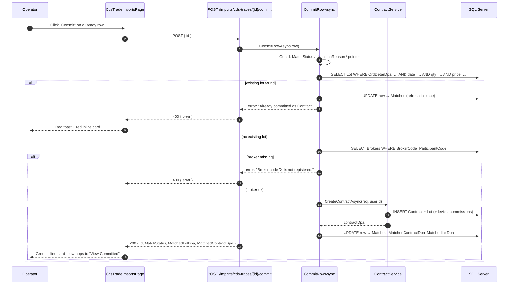

# CDS Trade Imports — End-to-End

This document covers the **daily CSD trade-file import**: how the broker
operator uploads the exchange's transaction statement, how rows are reconciled
against BrokerKnow's own orders/lots, and how matched rows are committed into
real `Lot` / `Contract` records. It mirrors the legacy "View Imported / View
Unmatched / View Committed" flow that lives in the original Kenyan-version
Classic ASP code, brought forward into the .NET 10 API + React SPA.

> Diagrams below are Mermaid; render natively in GitHub, in VS Code (with the
> Markdown Preview Mermaid extension) and in Confluence's Mermaid macro.

---

## 0. Overview



The pipeline has four logical phases:

1. **Upload & dedupe** — operator drops a CSV; the API hashes it, parses the
   header / rows, and refuses re-imports.
2. **Reconciliation** — every staged row is classified against the firm's open
   orders and existing lots.
3. **Operator review** — Matched / Unmatched / Discrepancy / Ignored rows are
   triaged in the UI.
4. **Commit** — eligible rows are turned into real `Lot` / `Contract` records
   via [`ContractService.CreateContractAsync`](../../brokerknow-api/src/BrokerKnow.Application/Contracts/ContractService.cs).

---

## 1. Source file (Crystal Reports CSV)

The exchange exports a Transaction Statement — usually from Crystal Reports —
listing every CSD-cleared trade for the day. BrokerKnow only parses **CSV**
natively; legacy `.xls` BIFF8 files must be re-exported as CSV from Crystal
(the export menu offers it).

The parser looks for a fixed column header line:

```
Client Code | Symbol | Sell Volume | Buy Volume | Price | Sett. Amount
```

Everything **above** that line is treated as report metadata. The parser
extracts:

| Field | From | Used for |
| --- | --- | --- |
| Trade date | A `From: dd/MM/yyyy` (or `yyyy-MM-dd`) line in the header | Filename context, dedupe, lot date |
| Exchange | Defaults to `MSE`; override via the form dropdown | Routing & dedupe |
| Market / Board | Header (e.g. `MAINBOARD`) | Audit only |
| Participant code | A `Participant: CEDAMWMW` line | Broker lookup at commit time |
| Client CDS code | First column on each row | Client lookup |
| Custodian CDS code | (when present) | Audit only |
| Symbol | `Symbol` column | Security lookup |
| Buy / Sell | Whichever of `Sell Volume` / `Buy Volume` is non-zero | Determines side |
| Quantity | The non-zero volume | Lot quantity |
| Price | `Price` column | Lot price |
| Settlement | `Sett. Amount` column | Discrepancy detection |

A single market trade always appears **twice** in the file — once on the seller
row, once on the buyer row — so a "172 row" file may resolve to ~86 economic
trades. Both rows reference the firm's participant code; only one of the two
will match the firm's open orders (the other belongs to the counter-party).

---

## 2. Upload

**Backend:** `POST /api/imports/cds-trades` →
[`CdsTradeImportsController.Upload`](../../brokerknow-api/src/BrokerKnow.Api/Controllers/CdsTradeImportsController.cs).
**Frontend:** the `UploadCard` in
[`CdsTradeImportsPage.tsx`](../../brokerknow-web/src/pages/Operations/CdsTradeImportsPage.tsx).

### 2.1 Inputs collected

| Field | Required | Notes |
| --- | --- | --- |
| File | yes | `.csv` only, ≤ 10 MB. Drag-drop or click. |
| Exchange | yes | `MSE` (Malawi only at the moment); SearchableSelect. |
| Trade date | yes | Auto-filled from the file header on file pick; operator can override via the date picker. |

### 2.2 Browser-side helpers (run on file pick)

When a file is dropped, the React page does three things **before** submit:

1. **Parses the trade date** out of the first 16 KB using
   `/From[\s,:"]+(\d{1,2})[/-](\d{1,2})[/-](\d{4})/i` (with a `yyyy-MM-dd`
   fallback) and pre-fills the date picker.
2. **Computes a SHA-256 digest** of the entire file via `crypto.subtle.digest`.
3. **Calls `GET /api/imports/cds-trades/check`** with `{ hash, fileName,
   tradeDate, exchange }` so the operator sees a duplicate banner *before* they
   click submit.



### 2.3 Server-side dedupe

`CdsTradeImportsController.FindDuplicateAsync` checks two signals in order:

1. **Exact bytes** — `SourceFileHash == @hash` (SHA-256 hex). The backing index
   is `IX_CdsImportedTrades_SourceFileHash`.
2. **`(filename + tradeDate + exchange)` triple** — catches legacy batches
   imported before the hash column existed.

If either matches, the upload is rejected with **HTTP 409 Conflict** and a body
containing the existing `{ batchId, sourceFile, importedAt, matchedBy }`.

### 2.4 Persistence

On success, the controller:

1. Allocates the next `BatchId` (`MAX(BatchId) + 1`).
2. Inserts one `CdsImportedTrade` per parsed CSV row — initially
   `MatchStatus = "Unmatched"`, with the file hash recorded so future re-imports
   are blocked.
3. Immediately runs `ReconcileBatchAsync(batchId)` so the operator sees results
   on the next refresh — no separate "reconcile" click needed.
4. Returns `{ batchId, tradeDate, exchange, inserted, summary }`.

---

## 3. Reconciliation

**Endpoint:** `POST /api/imports/cds-trades/batches/{id}/reconcile` (idempotent,
also called automatically after upload).
**Implementation:** `CdsTradeImportsController.ReconcileBatchAsync`.

For each row in a batch (skipping `Matched` and `Ignored`), the algorithm is:



Result statuses (mirrors legacy lines 2311–2317 of the Kenyan ASP):

| `MatchStatus` | `UnmatchReason` | Meaning |
| --- | --- | --- |
| `Matched` | — | A `Lot` already exists for this trade (no commit needed). |
| `Discrepancy` | — | A lot exists with the same date/symbol/side/CDS/qty but the **price** differs. Operator must reconcile manually. |
| `Unmatched` | `null` | **Ready to commit** — there's an open order detail (`MatchedOrdDetailDpa`) with enough remaining quantity. |
| `Unmatched` | `UnknownBroker` | `ParticipantCode` is not in `dbo.Brokers.BrokerCode`. |
| `Unmatched` | `UnknownSecurity` | `Symbol` is not in `dbo.Securities.SecurityCode`. |
| `Unmatched` | `UnknownClient` | `ClientCode` (CSD account) is not in `dbo.Client.ClientCdsNo`. CDA / custodian clients legitimately don't appear and are flagged for review. |
| `Unmatched` | `OrderHeld` | An order exists but it is on hold (`OrderHold = 1`) — release it first. |
| `Unmatched` | `NoPendingOrder` | No open order for this client/symbol/side exists. |
| `Unmatched` | `OverAllocated` | The trade qty exceeds the remaining order balance. |
| `Ignored` | — | Operator manually dismissed the row (with optional reason). |

### Quantity reservation

When two staged rows from the same import target the **same** open order
detail, reconciliation tracks per-order reservations in a local dictionary so
the second row doesn't double-claim the balance. If the second row would push
the running total past the order's remaining qty, it's flagged as
`OverAllocated` instead of `Ready`.

---

## 3a. Manual workarounds — fixing failing reconciliation checks

The legacy operations manual ([`BK_Files/Docs/BrokerKnow_Manual.txt`](BrokerKnow_Manual.txt),
section *"Dealing with Unmatched Trades"*) describes a fixed playbook for each
of the six unmatch reasons. The modern app uses the **same legacy tables** for
clients, securities, brokers and orders, so the legacy steps still apply
verbatim — only the navigation changes (web SPA instead of Classic ASP). The
table below maps each `UnmatchReason` to the manual's case number and the
modern remediation path.

| `UnmatchReason` | Legacy case | Root cause | Workaround | UI deep-link (rendered next to the badge) |
| --- | --- | --- | --- | --- |
| `NoPendingOrder` | **Case 1** — *Order Balance ≤ 0* | All matching orders for the client/symbol/side are fully filled (or none ever existed). | **Register a new order** for the client (Orders → Place Order, same symbol & side, qty ≥ trade qty), release it, then **Re-run reconciliation**. | **Place order →** `/orders/new?clientCds=…&symbol=…&side=…&qty=…&price=…` (PlaceOrder pre-fills these fields) |
| `OverAllocated` | **Case 2** — *Trade Quantity > Order Balance* | Open order exists but its remaining qty is smaller than the trade. | **Increase the order quantity** so the remaining balance covers the trade. Open the order detail, edit the `OrdDetailQty` upward by the shortfall, save, then **Re-run reconciliation**. (If the increase changes the client's exposure, re-check credit on Purchase orders.) | **Open order →** `/orders?symbol=…&client=…&side=…` (filtered list) |
| `UnknownClient` | **Case 3** — *Invalid client CDS* | The CSD account on the file is not registered on `dbo.Client.ClientCdsNo`, or it's spelled differently. | Two options: **(a)** register the client (Customer Service → Register Client) with the exact CSD account from the file, or **(b)** if the client already exists with a different CSD value, edit the client and set `ClientCdsNo` to the file's value. Then **Re-run reconciliation**. CDA / custodian rows that legitimately don't have a broker-side client can be **Ignored** with reason "CDA" / "custodian". | **Register client →** `/clients/new?cds=…` (AddClient pre-fills the CDS field) |
| `UnknownSecurity` | **Case 4** — *Invalid Security Code* | Symbol on the file differs from `dbo.Securities.SecurityCode` (e.g. exchange renamed it). | **Edit the security code** so it matches the file (Admin → Securities), or if it's a brand-new listing, register it. Then **Re-run reconciliation**. | **Open securities →** `/securities?search=…` |
| `OrderHeld` | **Case 5** — *Order Held* | A candidate order exists but `OrderHold = 1`. | **Release the order**: Operations → Release Orders, tick the row, save. The row drops off the held list. Back on the import, click **Re-run reconciliation** — the row should flip to `Unmatched · Ready`. | **Release order →** `/orders?status=held&symbol=…&client=…` |
| `UnknownBroker` | **Case 6** — *Broker not found* | Participant code on the file (e.g. `CEDAMWMW`) is not in `dbo.Brokers.BrokerCode`. | **Register the broker** (Admin → Brokers) with the exact participant BIC from the file, then **Re-run reconciliation**. | **Register broker →** `/operations/brokers?search=…` |

### Discrepancy rows

The manual treats these as part of "other discrepancies that may also exist
and call for sorting out trades". They are **not** committable — the price
diverges from an existing lot. Two ways forward:

* **Correct the existing lot/order** (e.g. amend the price on the open order
  to match the actual trade), then **Re-run reconciliation** — the row will
  re-classify to `Matched` against the corrected lot.
* If the existing lot is correct and the file is wrong, **Ignore** the row
  with a reason like *"file price wrong, lot is canonical"*.

### After every fix

Whatever workaround you applied, the final step is always:

1. Open the batch in **Operations → CDS Trade Imports**.
2. Click **Re-run reconciliation** (top-right of the batch detail card).
3. The row's status updates in place — fixed rows become **Ready** and pick up
   a green **Commit** button; click it (or use **Commit all eligible (N)** for
   bulk).

> **Tip:** the inline feedback card and red toast surface any per-row commit
> failures verbatim from the API, so you don't have to dig through logs to see
> why a single row in a bulk commit failed.

---

## 4. Operator review (UI)

The page lives at `/operations/cds-trade-imports` (frontend file:
[`CdsTradeImportsPage.tsx`](../../brokerknow-web/src/pages/Operations/CdsTradeImportsPage.tsx)).

### 4.1 Layout

```
┌─ Upload card ───────────────────────────────────────────────┐
│  Drop-zone │ Exchange │ Trade date │ Submit                  │
│            │ select   │ picker     │  + duplicate banner     │
└─────────────────────────────────────────────────────────────┘

┌─ Recent Batches table ──────────────────────────────────────┐
│  #  │ File │ Exchange │ Trade date │ Total │ Matched │ … │   │
└─────────────────────────────────────────────────────────────┘

┌─ Batch detail (when a batch is selected) ───────────────────┐
│  [View Imported] [View Unmatched] [View Committed]           │
│  search box · status filter · "Commit all eligible (N)"      │
│  Row table · per-row Commit / Ignore buttons                 │
│  Inline feedback card (red on error · green on success)      │
└─────────────────────────────────────────────────────────────┘
```

### 4.2 Tabs (mirror legacy buttons)

| Tab | What it shows |
| --- | --- |
| **View Imported** | Every row in the batch (any status). |
| **View Unmatched** | `MatchStatus ∈ { Unmatched, Discrepancy }` — needs operator action. |
| **View Committed** | `MatchStatus = Matched` — already turned into a `Lot`. |

The **status filter** dropdown (All / Matched / Ready / Unmatched /
Discrepancy / Ignored) and the free-text search apply on top of the active tab.

### 4.3 Row actions

| Row state | UI action |
| --- | --- |
| `Unmatched` + `UnmatchReason = null` + `MatchedOrdDetailDpa` set | **Commit** button (green) — turns the row into a `Lot` / `Contract`. |
| `Unmatched` with a reason, or `Discrepancy` | **Ignore** link — prompts for a reason and marks `MatchStatus = Ignored`. |
| `Matched` | Reason cell becomes a clickable `Order #N` link (hovers show `Contract #C`). |

`Commit all eligible (N)` calls the bulk endpoint with the IDs currently in
view — the operator can search/filter first to commit a slice.

### 4.4 Feedback & toasts

All commit / bulk-commit results render in two places:

1. **Inline card** at the top of the batch detail — green for success, red for
   any error, blue for neutral info.
2. **Toast** (top-right, auto-dismiss after 5s) for errors only, so the
   operator can scroll without losing the message.

---

## 5. Commit

A staged row is "committed" by allocating it against its
`MatchedOrdDetailDpa`, which creates a real `Lot` and a `Contract` via
`ContractService.CreateContractAsync` (the same code path used by manual trade
allocation in the order detail screen).

### 5.1 Endpoints

| Method | Route | Purpose |
| --- | --- | --- |
| `POST` | `/api/imports/cds-trades/{id}/commit` | Commit a single staged row. Returns 400 with `{ error }` on rejection. |
| `POST` | `/api/imports/cds-trades/batches/{batchId}/commit` | Bulk commit. Body: `{ ids: number[] }` — empty / null commits **all** eligible rows in the batch. Returns `{ committed, attempted, errors: [{ id, error }] }`. |

### 5.2 Per-row guard rails (`CommitRowAsync`)

Before allocating, the controller enforces:

1. **Status guard** — if `MatchStatus == "Matched"`, the request is rejected
   with `Already committed as Contract #N on yyyy-MM-dd HH:mm. Re-commit
   blocked.` (or a generic "already marked as committed" message if the
   contract DPA isn't set).
2. **Reason guard** — if `UnmatchReason` is set, the operator must resolve the
   underlying issue first (release the order, register the broker, etc.).
3. **Pointer guard** — `MatchedOrdDetailDpa` must be set; otherwise the batch
   needs a re-reconcile.
4. **Defence-in-depth lot lookup** — even if the in-memory status says
   `Unmatched`, the controller queries `dbo.Lots` for any lot with the same
   `(OrdDetailDpa, TradeDate, Quantity, Price)` signature. If one exists (e.g.
   a previous batch's commit, a race, a stale UI), the row is **refreshed to
   Matched** in place and the commit is rejected with the same blocking
   message — no duplicate `Lot` is ever created.
5. **Broker resolution** — the row's `ParticipantCode` must resolve to a
   `dbo.Brokers.BrokerCode`; otherwise `Broker code 'X' is not registered.`

Only after all five checks pass does the controller call:

```csharp
contractService.CreateContractAsync(new AllocateTradeRequest(
    OrdDetailDpa:   row.MatchedOrdDetailDpa.Value,
    BrokerDpa:      brokerDpa.Value,
    Price:          row.Price,
    Quantity:       row.Quantity,
    SlipNo:         $"CDS-{row.BatchId}-{row.Id}",
    TradeDate:      row.TradeDate,
    SettlementDate: row.TradeDate.AddDays(3)),
    userId);
```

…then re-locates the new `Lot` and stamps the import row with
`MatchStatus = "Matched"`, `MatchedContractDpa`, `MatchedLotDpa`, `MatchedAt`,
and a `MatchNotes = "Committed from CDS import."` audit string.

### 5.3 Sequence: commit a single row



### 5.4 Bulk commit

`POST /batches/{batchId}/commit` walks every commit-eligible row in the batch
(or the IDs you supply) through the same `CommitRowAsync` and aggregates the
results. The frontend reports e.g. `Committed 12 of 14 rows. 2 failed.` — the
two failures appear in the response's `errors` array with the per-row reason.

### 5.5 Ignore

`POST /api/imports/cds-trades/{id}/ignore` with body `{ reason }` flips a row
to `MatchStatus = "Ignored"`, preserving the reason in `MatchNotes`. Ignored
rows are hidden from "View Unmatched" but remain visible under "View Imported"
for audit.

---

## 6. Schema reference

### 6.1 `dbo.CdsImportedTrades`

| Column | Type | Notes |
| --- | --- | --- |
| `Id` | `int identity` | PK. |
| `BatchId` | `int` | One per uploaded file. |
| `TradeDate` | `datetime` | From file header. |
| `Exchange` | `nvarchar` | `MSE`, etc. |
| `Market` | `nvarchar?` | e.g. `MAINBOARD`. |
| `ParticipantCode` | `nvarchar?` | Broker BIC. |
| `ClientCode` | `nvarchar?` | CSD account. |
| `CustodianCode` | `nvarchar?` | CSD account (custodian). |
| `Symbol` | `nvarchar` | Listed symbol. |
| `BuySell` | `char(1)` | `B` / `S`. |
| `Quantity` | `int` | |
| `Price` | `decimal` | |
| `Settlement` | `decimal` | Gross from the file. |
| `SourceFile` | `nvarchar?` | Original filename. |
| `SourceFileHash` | `nvarchar(64)` | SHA-256 hex; indexed (`IX_CdsImportedTrades_SourceFileHash`). |
| `MatchStatus` | `nvarchar` | `Unmatched` / `Matched` / `Discrepancy` / `Ignored`. |
| `UnmatchReason` | `nvarchar?` | One of the six canonical reasons. |
| `MatchedOrdDetailDpa` | `int?` | Open order this row maps to. |
| `MatchedLotDpa` | `int?` | Set after commit. |
| `MatchedContractDpa` | `int?` | Set after commit. |
| `MatchNotes` | `nvarchar?` | Free-text audit / discrepancy details. |
| `MatchedAt` | `datetime?` | Last reconciliation/commit timestamp. |
| `CreatedAt / CreatedBy / TimeChanged / ChangedBy` | audit | From `AuditableEntity`. |

The `SourceFileHash` column is created idempotently by `Program.cs` startup
SQL — no migration is needed for legacy databases.

### 6.2 Touched legacy tables

| Table | Touched by | When |
| --- | --- | --- |
| `dbo.Brokers` | `CommitRowAsync` | Resolve `ParticipantCode → BrokerDpa`. |
| `dbo.Securities` | `ReconcileBatchAsync` | Validate symbol. |
| `dbo.Client` | `ReconcileBatchAsync` | Validate CSD account. |
| `tbOrder` / `OrdDetail` | `ReconcileBatchAsync` | Find candidate open orders. |
| `Lot` / `Contract` | `ReconcileBatchAsync` (read), `ContractService.CreateContractAsync` (write) | Detect existing lots; create new ones on commit. |

---

## 7. API quick reference

| Method | Route | Notes |
| --- | --- | --- |
| `GET` | `/api/imports/cds-trades/batches?take=50` | Recent batches with reconciliation counts. |
| `GET` | `/api/imports/cds-trades/batches/{batchId}` | Every row in a batch (incl. resolved `MatchedOrderDpa` for deep-linking). |
| `GET` | `/api/imports/cds-trades/check?hash=&fileName=&tradeDate=&exchange=` | Pre-submit duplicate check. |
| `POST` | `/api/imports/cds-trades` | Multipart upload: `file`, `exchange`, `tradeDate`. Auto-runs reconcile. |
| `POST` | `/api/imports/cds-trades/batches/{batchId}/reconcile` | Re-classify every non-`Matched`/`Ignored` row. |
| `POST` | `/api/imports/cds-trades/{id}/ignore` | Body `{ reason }`. |
| `POST` | `/api/imports/cds-trades/{id}/commit` | Single-row commit. |
| `POST` | `/api/imports/cds-trades/batches/{batchId}/commit` | Body `{ ids?: number[] }`. Empty → commit all eligible. |

All endpoints require an authenticated session
(`[Authorize]` on the controller).

---

## 7a. Trades that never appear on the CSD file

If a trade was executed off-system or simply isn't in the day's CSD file, the
operator can still record it manually — there is no need to wait for or fudge
the import. The **manual counterpart** to the commit pipeline is the
**+ Allocate** button on the Order Details page (`/orders/{id}`):

| Path | Trigger | Endpoint | Bulk? |
| --- | --- | --- | --- |
| Bulk import | Drag & drop CSD CSV → **Commit selected / all** on `/operations/cds-trade-imports` | `POST /api/imports/cds-trades/{id}/commit` (and the batch variant) | yes |
| Manual single | **+ Allocate** on a single item row of the order detail page | `POST /api/orders/allocate` | no |
| Manual bulk | Tick item rows → **Allocate selected (N) / all (N)** on the order detail page | `POST /api/orders/allocate-bulk` | yes |

All three paths converge on
[`ContractService.CreateContractAsync`](../../brokerknow-api/src/BrokerKnow.Application/Contracts/ContractService.cs)
and produce identical `Lot` + `Contract` + `LevyContract` records, so
downstream commissions, levies, broker vouchers and journal postings are
indistinguishable regardless of which entry point was used.

> **Operator rule of thumb.** Use the CDS import for everything that *is* on
> the day's CSD file; use **+ Allocate** (single or bulk) for paper slips,
> off-market deals and any row the import classified as `UnknownSecurity` /
> `UnknownClient` that you've since fixed up but don't want to wait to
> re-reconcile.

---

## 8. Operational FAQ

**Q: I uploaded the same file twice. What happens?**
The second upload is rejected with HTTP 409 and the operator sees a yellow
duplicate banner *before* they click submit (the dropzone hashes the file and
calls `/check`). Hash dedupe works for any file uploaded after the
`SourceFileHash` column was added; older batches still block via the
`(filename + tradeDate + exchange)` fallback.

**Q: A row is stuck on `OrderHeld`. What do I do?**
Release the candidate order (Orders → Detail → Release), then click
**Re-run reconciliation** in the batch header. The row will flip to
`Unmatched · Ready` if everything else lines up.

**Q: The operator double-clicked Commit and we got two contracts. Possible?**
No. The defence-in-depth lookup in `CommitRowAsync` queries `dbo.Lots` for an
existing `(OrdDetailDpa, TradeDate, Qty, Price)` signature *before* calling
`CreateContractAsync`. If one is found the row is refreshed to `Matched` and
the second click is rejected with `Already committed as Contract #N. Re-commit
blocked.`

**Q: Can I commit a `Discrepancy` row?**
No. The price differs from the existing lot — investigate manually. Either
**Ignore** the row (with a reason) or correct the underlying lot/order, then
re-reconcile.

**Q: Why does my 172-row file only produce ~86 commits?**
Each market trade appears twice (buyer + seller side). Only the side belonging
to the firm's clients matches an open order; the counter-party side becomes
`UnknownClient` and is left alone.
