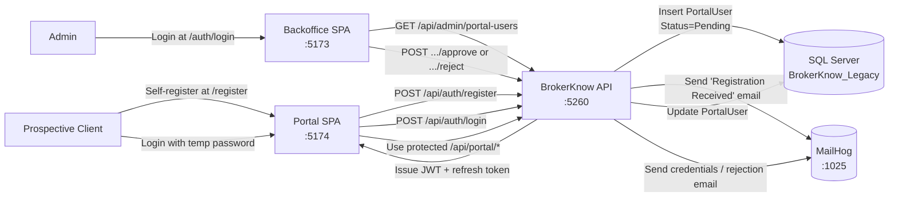
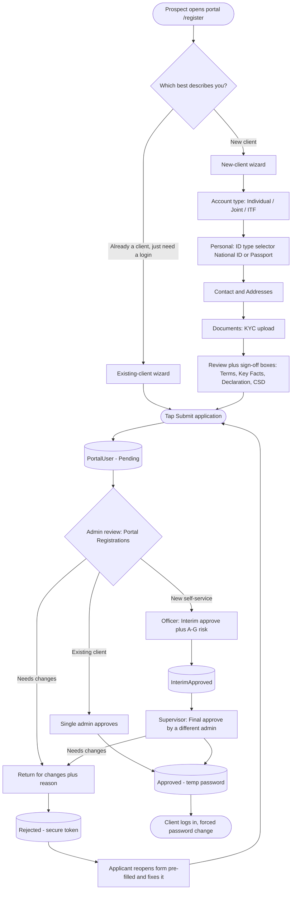
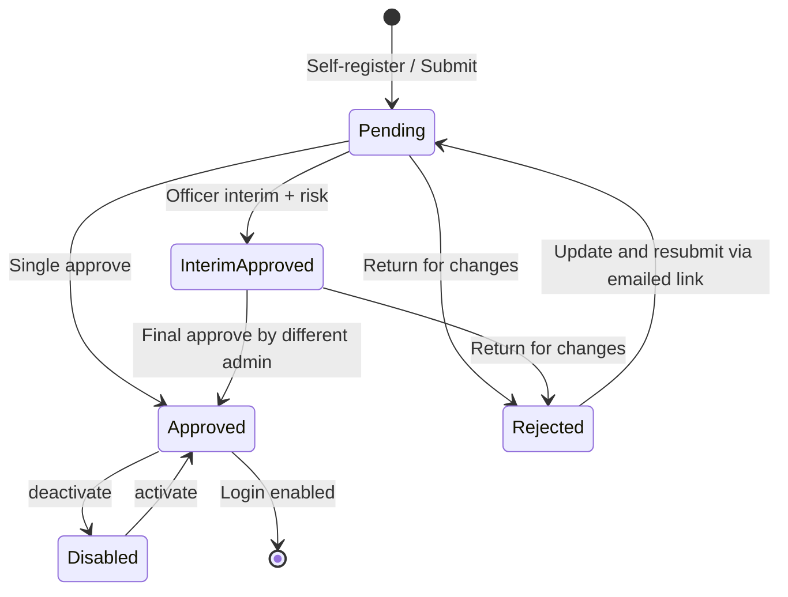

# Client Portal — Registration & Account Lifecycle

This document describes the end-to-end flow for new client portal accounts:
**Self-service registration → Admin review → Approval / Rejection → Login → Portal use**.

> For what happens **after** a client exists — the CSD F1 + Agreement of Mandate
> forms, Residential Address Verification, Customer Risk Rating and the
> officer → supervisor approval chain — see
> [`Account_Opening_Workflow.md`](Account_Opening_Workflow.md).

---

## 1. Architecture Overview



### Registration journey (end to end)



---

## 2. Database Schema

Two new tables added to the legacy database:

### `PortalUsers`

| Column | Type | Notes |
|---|---|---|
| `Id` | INT IDENTITY | Primary key |
| `Email` | NVARCHAR(256) | UNIQUE, lowercase |
| `PasswordHash` | NVARCHAR(512) | BCrypt hash |
| `FirstName`, `LastName` | NVARCHAR(100) | Required |
| `Phone`, `OfficePhone`, `HomePhone` | NVARCHAR(50) | Optional |
| `IdNumber`, `CdsNumber` | NVARCHAR(50) | Optional |
| `DateOfBirth` | DATETIME2 | Optional, validated 18+ on SPA |
| `PhysicalAddress`, `PostalAddress` | NVARCHAR(500) | Optional |
| `ContactPerson` | NVARCHAR(200) | Optional next-of-kin |
| `AccountType` | NVARCHAR(20) | `Individual` (default) / `Joint` / `ITF` |
| `JointApplicants` | NVARCHAR(MAX) | JSON array of additional joint holders (name, ID type, ID number, relationship) |
| `ItfBeneficiary` | NVARCHAR(MAX) | JSON for the In-Trust-For beneficiary (name, DOB, relationship) |
| `Agreements` | NVARCHAR(MAX) | JSON of the client's sign-off (terms, key facts, declaration, CSD) ticked on the review step |
| `RiskAssessment` | NVARCHAR(MAX) | JSON of the officer's Customer Risk Rating (Sections A–G + total + band), recorded at interim approval |
| `SelfRegisteredNewClient` | BIT NULL | `1` = a new client who self-registered (needs two-stage approval); `NULL` = existing-client login / staff-created (single approval) |
| `InterimApprovedBy` | INT | Admin who gave the interim (officer) approval — drives maker ≠ checker |
| `InterimApprovedAt` | DATETIME2 | When the interim approval was given |
| `ResubmitToken` | NVARCHAR(128) | Single-use capability token emailed on “return for changes” so the applicant can resubmit |
| `ResubmitTokenExpiresAt` | DATETIME2 | Expiry of the resubmit token (30 days from return) |
| `Role` | NVARCHAR(20) | `Client` or `Admin` |
| `Status` | NVARCHAR(20) | `Pending` → `InterimApproved` → `Approved` / `Rejected` |
| `Active` | BIT | Soft-disable toggle |
| `ClientDpa` | INT | FK to legacy `Client` table once approved |
| `CreatedAt`, `ApprovedAt` | DATETIME2 | Audit timestamps |
| `ApprovedBy` | INT | Admin user id who approved |
| `RejectionReason` | NVARCHAR(500) | Shown in email + at login |

### `PortalRefreshTokens`

| Column | Type | Notes |
|---|---|---|
| `Id` | INT IDENTITY | Primary key |
| `PortalUserId` | INT | FK → `PortalUsers`, CASCADE DELETE |
| `Token` | NVARCHAR(512) | UNIQUE, base64 random 64 bytes |
| `ExpiresAt` | DATETIME2 | Default 14 days from issue |
| `CreatedAt` | DATETIME2 | Audit |
| `Revoked` | BIT | Set true on logout or rotation |

---

## 3. Self-Registration

### 3.1 SPA flow

The portal Register page (`/register`) collects:

| Section | Fields |
|---|---|
| **Personal Information** | First Name *, Last Name *, ID Document Type * (National ID / Passport, searchable Select2-style picker), ID/Passport Number, CDS Number, Date of Birth |
| **Account Type** (new applicants) | Held as: Individual / Joint / ITF. **Joint** → add/remove holders, each with name, ID document type, ID number, relationship, **and an ID document upload (their KYC)**. **ITF (In Trust For)** → beneficiary name, DOB, relationship (e.g. a minor child) |
| **Contact Details** | Email *, Cell Phone, Office Phone, Home Phone |
| **Addresses** | Postal Address, Physical Address, Contact Person |
| **KYC Documents** | ID document *, proof of address *, source of funds *, optional supporting docs |
| **Review — sign-off** (new applicants) | Tick to confirm: **Terms & Conditions**, **Key Facts Statement**, **Declaration**, **CSD terms / Stockbrokers Mandate**. All four are required to submit and are shown to the approver. |

> **Sign-off checkboxes:** new applicants must tick all four confirmations on the
> review step before the application can be submitted. The ticked values are
> stored as JSON in `PortalUsers.Agreements` and surfaced to the approver during
> review. Existing-client login requests skip this (they are not opening a new
> account).

> **Joint accounts (PM model):** the person who registers becomes the **contact
> person** and the **only login holder**. Additional holders are captured as
> *names + their KYC* on the same application — they do not register separately,
> and the whole joint account goes through **one** approval. The form states this
> explicitly and requires an ID document for each named holder.

The form is **mobile-first** (larger touch targets, single-column on phones) since
most clients register from a phone.

Validation is **inline only** (no HTML5 tooltips):

* `noValidate` is set on the form
* Each field is validated on **blur** the first time, then **live** as the user types
* Required fields: First Name, Last Name, Email
* Email must match `^[^\s@]+@[^\s@]+\.[^\s@]+$`
* Phone numbers (when filled) must match `^[+\d\s()-]{7,20}$`
* Date of Birth uses **Flatpickr** dropdown calendar with `maxDate=today`; computed age must be 18-120
* Errors render below each field in red; invalid fields get red borders

### 3.2 API endpoint

The request is **multipart/form-data** (KYC files travel with the scalar fields):

```http
POST /api/auth/register
Content-Type: multipart/form-data

email            = client@example.com
firstName        = John
lastName         = Banda
idDocumentType   = National ID            # National ID | Passport
idNumber         = ID-12345
cdsNumber        = CDS-000123
dateOfBirth      = 1985-03-12
accountType      = Joint                  # Individual | Joint | ITF
jointApplicants  = [{"fullName":"Mary Banda","idDocumentType":"National ID","idNumber":"ID-9","relationship":"Spouse"}]
itfBeneficiary   = {"fullName":"…","dateOfBirth":"…","relationship":"…"}   # ITF only
physicalAddress  = Livingstone Towers, Blantyre
postalAddress    = P.O. Box 999, Blantyre
contactPerson    = Jane Banda
idDocument       = <file>                 # primary applicant KYC
proofOfAddress   = <file>
sourceOfFunds    = <file>
jointIdDocuments = <file>, <file>         # one per named joint holder, in order
```

Server-side behaviour:

1. Validates Email, FirstName, LastName as required; validates every uploaded
   file (size + extension)
2. Lowercases email and checks for uniqueness (and ID / CDS duplicates)
3. Generates an unusable random password (64 random bytes, base64) and BCrypt-hashes it
4. Inserts `PortalUser` with `Status = Pending`, `Role = Client`, `Active = true`,
   persisting `AccountType` + the `JointApplicants` / `ItfBeneficiary` JSON
5. Saves KYC files under `/uploads/portal-applications/{userId}/` as
   `{guid}__{category}__{original}`; each joint holder's ID is stored as
   `joint-id-{n}` (1-based, in holder order)
6. Sends a **"Registration Received"** branded email (best-effort)
7. Returns 200 with `{ message, userId }`

The user **cannot log in yet** — `/auth/login` will return:

```
401 — Your account is pending approval. Please wait for admin confirmation.
```

---

## 4. Admin Review (Backoffice)

### 4.1 Where to find it

Admin signs in at `http://localhost:5173/auth/login`, then navigates to:

**Administration → Users → Portal Registrations**

The page filters by `Status` (All / Pending / Approved / Rejected) and shows for each row:

* Full name, email, phone, ID/Passport
* Status badge (`Pending`, `Approved`, `Rejected`) + `Disabled` if `Active = false`
* Linked client ID (once approved)
* Registration date

The detail view also surfaces the **account type**: for Joint it shows the primary
contact / login holder plus each joint holder (name, relationship, ID), and notes
that each holder's ID document is listed under **Documents** as `joint-id-N`; for
ITF it shows the beneficiary (name, DOB, relationship).

Action buttons per row:

* **Interim approve + risk** — self-registered new clients (Pending): officer records the A–G Customer Risk Rating and an interim approval
* **Final approve** — self-registered new clients (InterimApproved): a **different** admin gives the final approval (maker ≠ checker)
* **Approve** — existing-client login requests (Pending): single-step approval
* **Return for changes** — Pending or InterimApproved rows: emails the applicant a resubmit link (see §4.5)
* **Disable / Enable** — toggle `Active`

### 4.2 Approval flow

**Two paths**, decided by `SelfRegisteredNewClient`:

* **New self-service client (two-stage, maker ≠ checker).** An **Officer** clicks
  *Interim approve + risk*, fills the Customer Risk Rating (Sections A–G — total
  and band auto-populate, with the High-occupation / high-risk-jurisdiction
  override), and records the interim approval (`Status = InterimApproved`,
  `InterimApprovedBy/At` set). A **different** admin then clicks *Final approve*;
  the API rejects the attempt if the same admin tries both steps.

  ```http
  POST /api/admin/portal-users/{id}/interim-approve   # officer + A–G risk
  POST /api/admin/portal-users/{id}/approve           # different admin, final
  ```

* **Existing-client login request (single step).** One admin approves directly
  from `Pending`.

Clicking **Approve** (final) opens a modal with a client-link option:

```http
POST /api/admin/portal-users/{id}/approve
Content-Type: application/json

{ "clientDpa": 3430 }
```

Server-side behaviour:

1. Verifies the user is currently `Pending` (otherwise returns 400)
2. Generates a memorable temp password in the format `Bk-XXXX-9999`
   * 4 random uppercase consonants (excludes I, O for clarity)
   * 4 random digits 2-9
   * BCrypt-hashed before storage
3. Sets `Status = Approved`, `ApprovedAt = UtcNow`, `ApprovedBy = current admin`, optionally `ClientDpa`
4. Sends the **"Account Approved"** email containing email + temp password + sign-in link
5. Returns the temp password to the admin SPA so a green **Credentials Modal** appears with **Copy** buttons (for fallback if email delivery is questionable)

### 4.3 Return for changes (resubmittable)

```http
POST /api/admin/portal-users/{id}/reject
Content-Type: application/json

{ "reason": "Please attach a clearer copy of your ID." }
```

Rejection is **not** a dead end — it returns the application to the applicant for
correction. Server-side behaviour:

1. Allowed from `Pending` or `InterimApproved`
2. Sets `Status = Rejected`, stores `RejectionReason`, clears any interim approval
3. Issues a single-use **`ResubmitToken`** (hex, 30-day expiry)
4. Emails the applicant an **“Update & resubmit”** link `{PortalUrl}/register?resubmit=<token>`
5. Returns `{ message, resubmitUrl }` so staff can copy/share the link if email delivery is unreliable

### 4.4 Resubmit (applicant, token-gated)

```http
GET  /api/auth/resubmit/{token}    # returns the saved application, pre-filled
POST /api/auth/resubmit/{token}    # applicant submits the corrected application
```

The link reopens the registration form **pre-filled** with the saved details and
shows the return reason. KYC re-upload is optional — the originals stay on file
unless the applicant attaches replacements. On submit the application goes back to
`Status = Pending`, the token is consumed (single-use), and any interim approval /
risk rating is cleared so the two-stage flow restarts. Only `Rejected` rows with
an unexpired token are reachable, so the endpoint cannot touch other accounts.

### 4.5 Disable / Enable

```http
POST /api/admin/portal-users/{id}/deactivate   → Active = false
POST /api/admin/portal-users/{id}/activate     → Active = true
```

Disabled users cannot log in (`401 — Your account has been deactivated.`) but their data remains intact.

---

## 5. Email Delivery

All emails are sent via SMTP using **MailKit**. In dev, point the SMTP host at **MailHog** (`localhost:1025`). MailHog's web UI runs at `http://localhost:8025` for inspection.

### 5.1 Configuration (`appsettings.json`)

```json
"Email": {
  "Host": "localhost",
  "Port": 1025,
  "UseSsl": false,
  "Username": "",
  "Password": "",
  "FromAddress": "no-reply@brokerknow.local",
  "FromName": "BrokerKnow Portal",
  "PortalUrl": "http://localhost:5174",
  "LogoUrl": "http://localhost:5260/brokerknow-logo.jpg",
  "CompanyName": "BrokerKnow",
  "SupportEmail": "support@brokerknow.local"
}
```

The API serves the BrokerKnow logo from `wwwroot/brokerknow-logo.jpg` so the email's `` tag works without the SPA being up.

### 5.2 Email templates

All three emails share a polished branded layout:

* White card with subtle shadow on a soft gray background
* BrokerKnow logo header
* Color-coded status pill badge
* Hero heading + greeting + lead paragraph
* Contextual content blocks (callouts, info tables)
* Optional CTA button (rounded brand-blue)
* Footer with support email + copyright

| Trigger | Subject | Badge | Color |
|---|---|---|---|
| `POST /auth/register` succeeds | `BrokerKnow — Registration Received` | `REGISTRATION RECEIVED` | Blue |
| `POST /admin/portal-users/{id}/approve` succeeds | `BrokerKnow — Your Account is Approved` | `ACCOUNT APPROVED` | Green |
| `POST /admin/portal-users/{id}/reject` succeeds | `BrokerKnow — Please update your application` | `ACTION NEEDED` | Amber |

The approval email contains a two-row credentials table (Email, Temporary Password in monospace), an amber security warning, and a **"Sign in to your account"** CTA button linking to `{PortalUrl}/login`. The return-for-changes email carries the reason and an **"Update & resubmit"** CTA button linking to `{PortalUrl}/register?resubmit=<token>`.

### 5.3 Failure handling

Email failures are caught inside `SmtpEmailService.SendAsync` and logged at `Error` level. They never throw, so a downed SMTP server will not block registration or approval.

---

## 6. Login & JWT

### 6.1 Endpoint

```http
POST /api/auth/login
Content-Type: application/json

{ "email": "client@example.com", "password": "Bk-NXTQ-4738" }
```

Possible responses:

| Status | Reason |
|---|---|
| 200 | Returns `{ accessToken, refreshToken, expiresAt, user }` |
| 400 | Email or password missing |
| 401 | Invalid credentials, deactivated, pending, or rejected |

### 6.2 JWT claims

Issued via `JwtSecurityToken` with HMAC-SHA256, lifetime configurable via `Jwt:AccessTokenMinutes` (default 15 minutes):

```
sub        = PortalUser.Id
email      = PortalUser.Email
role       = "Client" | "Admin"
firstName  = PortalUser.FirstName
lastName   = PortalUser.LastName
clientDpa  = PortalUser.ClientDpa  (only if linked)
```

### 6.3 Refresh tokens

Refresh tokens (64 random bytes, base64) are stored in `PortalRefreshTokens` with a 14-day default lifetime.

```http
POST /api/auth/refresh           { "refreshToken": "..." }
POST /api/auth/logout            { "refreshToken": "..." }   # revokes the token
GET  /api/auth/me                                            # returns the JWT user
```

Refresh rotates: the old token is marked `Revoked = true`, a fresh one is issued.

---

## 7. Portal Endpoints (Client Role)

All routes under `/api/portal/*` require `[Authorize(Roles = "Client")]` and resolve the client from the JWT's `clientDpa` claim.

| Endpoint | Description |
|---|---|
| `GET /api/portal/profile` | Read-only client profile from `tbClient` |
| `GET /api/portal/balance` | Opening balance, current balance, outstanding, credit limit |
| `GET /api/portal/orders?page=1&pageSize=15` | Paginated list of the client's orders |
| `GET /api/portal/statement?from=&to=&page=1&pageSize=15` | Paginated transaction statement |
| `GET /api/portal/statement.pdf?from=&to=` | Branded statement PDF |
| `GET /api/portal/statement.csv?from=&to=` | CSV statement |

The statement endpoints reuse the same `BuildStatementAsync` helper as the admin's `/api/clients/{id}/statement`, ensuring identical numbers and the same QuestPDF template (with BrokerKnow logo).

---

## 8. Status State Diagram



* **Pending** — registered, awaiting review. Cannot log in yet.
* **InterimApproved** — officer recorded the A–G risk rating + interim approval (new self-service client); awaiting a **different** admin's final approval (maker ≠ checker).
* **Approved** — single approve is used for existing-client login requests; login works and can be temporarily disabled.
* **Rejected** — returned for changes; the applicant can update and resubmit via the emailed token, which moves it back to **Pending**.
* **Disabled** (`Active = false` overlay) — login refused regardless of `Status`.

---

## 9. Security Notes

* Passwords are hashed with **BCrypt** (`BCrypt.Net-Next` v4.1, default 11 rounds).
* The placeholder password set during registration is **never** revealed; only the admin-generated temp password is shared.
* JWT `Key` in `appsettings.json` is a placeholder — must be replaced with at least 32 chars of randomness in production.
* CORS allows the dev SPA ports (`5173-5176`); production must whitelist real origins explicitly.
* The portal's `clientDpa` claim is the only way to access portal data — even if a Client JWT is forged/stolen for another user, they can only see their own linked client. There is **no client-id parameter** on `/api/portal/*` routes.

---

## 10. Code Map

| Concern | File |
|---|---|
| Domain entity | `BrokerKnow.Domain/Entities/PortalUser.cs` |
| EF configuration | `BrokerKnow.Infrastructure/Persistence/Configurations/PortalUserConfiguration.cs` |
| Schema bootstrap (idempotent column adds) | `BrokerKnow.Api/Program.cs` |
| Auth endpoints (register + resubmit) | `BrokerKnow.Api/Controllers/AuthController.cs` |
| Admin user mgmt (interim/final approve, return-for-changes) | `BrokerKnow.Api/Controllers/PortalUsersController.cs` |
| Risk-rating catalog (Sections A–G) | `BrokerKnow.Api/Controllers/AccountOpeningRiskCatalog.cs` |
| Client portal endpoints | `BrokerKnow.Api/Controllers/PortalController.cs` |
| Email service | `BrokerKnow.Api/Services/EmailService.cs` |
| Portal SPA — Register | `brokerknow-portal/src/pages/RegisterPage.tsx` |
| Portal SPA — Searchable select (ID / account type) | `brokerknow-portal/src/components/form/SearchSelect.tsx` |
| Portal SPA — Login | `brokerknow-portal/src/pages/LoginPage.tsx` |
| Portal SPA — Auth context | `brokerknow-portal/src/context/AuthContext.tsx` |
| Backoffice — Users page | `brokerknow-web/src/pages/Admin/PortalUsersPage.tsx` |
| Backoffice — Login | `brokerknow-web/src/pages/Admin/AdminLogin.tsx` |
