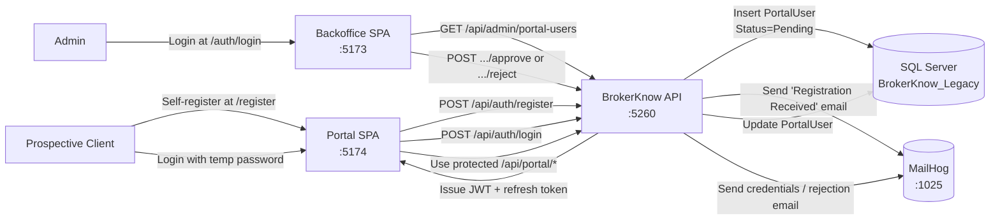
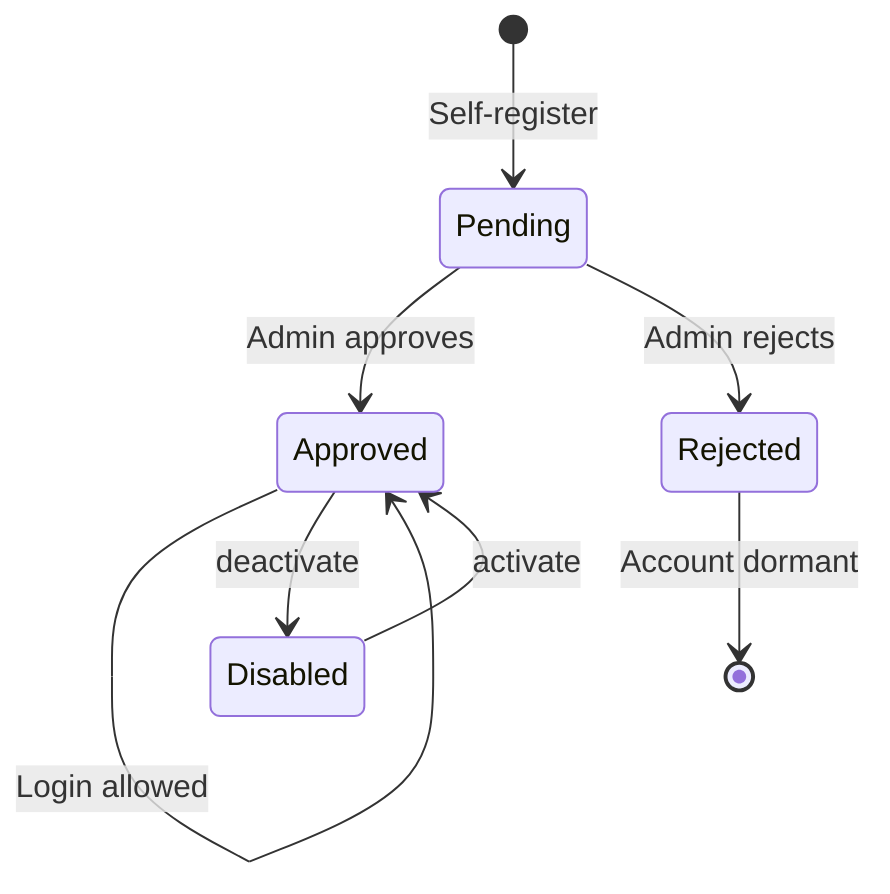

# Client Portal — Registration & Account Lifecycle

This document describes the end-to-end flow for new client portal accounts:
**Self-service registration → Admin review → Approval / Rejection → Login → Portal use**.

---

## 1. Architecture Overview



---

## 2. Database Schema

Two new tables added to the legacy database:

### `PortalUsers`

| Column | Type | Notes |
|---|---|---|
| `Id` | INT IDENTITY | Primary key |
| `Email` | NVARCHAR(256) | UNIQUE, lowercase |
| `PasswordHash` | NVARCHAR(512) | BCrypt hash |
| `FirstName`, `LastName` | NVARCHAR(100) | Required |
| `Phone`, `OfficePhone`, `HomePhone` | NVARCHAR(50) | Optional |
| `IdNumber`, `CdsNumber` | NVARCHAR(50) | Optional |
| `DateOfBirth` | DATETIME2 | Optional, validated 18+ on SPA |
| `PhysicalAddress`, `PostalAddress` | NVARCHAR(500) | Optional |
| `ContactPerson` | NVARCHAR(200) | Optional next-of-kin |
| `Role` | NVARCHAR(20) | `Client` or `Admin` |
| `Status` | NVARCHAR(20) | `Pending` → `Approved` / `Rejected` |
| `Active` | BIT | Soft-disable toggle |
| `ClientDpa` | INT | FK to legacy `Client` table once approved |
| `CreatedAt`, `ApprovedAt` | DATETIME2 | Audit timestamps |
| `ApprovedBy` | INT | Admin user id who approved |
| `RejectionReason` | NVARCHAR(500) | Shown in email + at login |

### `PortalRefreshTokens`

| Column | Type | Notes |
|---|---|---|
| `Id` | INT IDENTITY | Primary key |
| `PortalUserId` | INT | FK → `PortalUsers`, CASCADE DELETE |
| `Token` | NVARCHAR(512) | UNIQUE, base64 random 64 bytes |
| `ExpiresAt` | DATETIME2 | Default 14 days from issue |
| `CreatedAt` | DATETIME2 | Audit |
| `Revoked` | BIT | Set true on logout or rotation |

---

## 3. Self-Registration

### 3.1 SPA flow

The portal Register page (`/register`) collects:

| Section | Fields |
|---|---|
| **Personal Information** | First Name *, Last Name *, ID/Passport, CDS Number, Date of Birth, Contact Person |
| **Contact Details** | Email *, Cell Phone, Office Phone, Home Phone |
| **Addresses** | Postal Address, Physical Address |

Validation is **inline only** (no HTML5 tooltips):

* `noValidate` is set on the form
* Each field is validated on **blur** the first time, then **live** as the user types
* Required fields: First Name, Last Name, Email
* Email must match `^[^\s@]+@[^\s@]+\.[^\s@]+$`
* Phone numbers (when filled) must match `^[+\d\s()-]{7,20}$`
* Date of Birth uses **Flatpickr** dropdown calendar with `maxDate=today`; computed age must be 18-120
* Errors render below each field in red; invalid fields get red borders

### 3.2 API endpoint

```http
POST /api/auth/register
Content-Type: application/json

{
  "email":       "client@example.com",
  "firstName":   "John",
  "lastName":    "Banda",
  "phone":       "+265 999 123 456",
  "officePhone": "+265 1 234 567",
  "homePhone":   "+265 1 765 432",
  "idNumber":    "ID-12345",
  "cdsNumber":   "CDS-000123",
  "dateOfBirth": "1985-03-12",
  "physicalAddress": "Livingstone Towers, Blantyre",
  "postalAddress":   "P.O. Box 999, Blantyre",
  "contactPerson":   "Jane Banda"
}
```

Server-side behaviour:

1. Validates Email, FirstName, LastName as required
2. Lowercases email and checks for uniqueness
3. Generates an unusable random password (64 random bytes, base64) and BCrypt-hashes it
4. Inserts `PortalUser` with `Status = Pending`, `Role = Client`, `Active = true`
5. Sends a **"Registration Received"** branded email via MailHog (best-effort; failures are logged but never block the response)
6. Returns 200 with `{ message, userId }`

The user **cannot log in yet** — `/auth/login` will return:

```
401 — Your account is pending approval. Please wait for admin confirmation.
```

---

## 4. Admin Review (Backoffice)

### 4.1 Where to find it

Admin signs in at `http://localhost:5173/auth/login`, then navigates to:

**Administration → Users → Portal Registrations**

The page filters by `Status` (All / Pending / Approved / Rejected) and shows for each row:

* Full name, email, phone, ID/Passport
* Status badge (`Pending`, `Approved`, `Rejected`) + `Disabled` if `Active = false`
* Linked client ID (once approved)
* Registration date

Action buttons per row:

* **Approve** — only on Pending rows, opens modal
* **Reject** — only on Pending rows, opens modal
* **Disable / Enable** — toggle `Active`

### 4.2 Approval flow

Clicking **Approve** opens a modal with a client-link dropdown (optional):

```http
POST /api/admin/portal-users/{id}/approve
Content-Type: application/json

{ "clientDpa": 3430 }
```

Server-side behaviour:

1. Verifies the user is currently `Pending` (otherwise returns 400)
2. Generates a memorable temp password in the format `Bk-XXXX-9999`
   * 4 random uppercase consonants (excludes I, O for clarity)
   * 4 random digits 2-9
   * BCrypt-hashed before storage
3. Sets `Status = Approved`, `ApprovedAt = UtcNow`, `ApprovedBy = current admin`, optionally `ClientDpa`
4. Sends the **"Account Approved"** email containing email + temp password + sign-in link
5. Returns the temp password to the admin SPA so a green **Credentials Modal** appears with **Copy** buttons (for fallback if email delivery is questionable)

### 4.3 Rejection flow

```http
POST /api/admin/portal-users/{id}/reject
Content-Type: application/json

{ "reason": "Unable to verify identity documents." }
```

Server-side behaviour:

1. Verifies user is `Pending`
2. Sets `Status = Rejected`, stores `RejectionReason`
3. Sends the **"Application Update"** email with the reason
4. Returns 200

### 4.4 Disable / Enable

```http
POST /api/admin/portal-users/{id}/deactivate   → Active = false
POST /api/admin/portal-users/{id}/activate     → Active = true
```

Disabled users cannot log in (`401 — Your account has been deactivated.`) but their data remains intact.

---

## 5. Email Delivery

All emails are sent via SMTP using **MailKit**. In dev, point the SMTP host at **MailHog** (`localhost:1025`). MailHog's web UI runs at `http://localhost:8025` for inspection.

### 5.1 Configuration (`appsettings.json`)

```json
"Email": {
  "Host": "localhost",
  "Port": 1025,
  "UseSsl": false,
  "Username": "",
  "Password": "",
  "FromAddress": "no-reply@brokerknow.local",
  "FromName": "BrokerKnow Portal",
  "PortalUrl": "http://localhost:5174",
  "LogoUrl": "http://localhost:5260/brokerknow-logo.jpg",
  "CompanyName": "BrokerKnow",
  "SupportEmail": "support@brokerknow.local"
}
```

The API serves the BrokerKnow logo from `wwwroot/brokerknow-logo.jpg` so the email's `` tag works without the SPA being up.

### 5.2 Email templates

All three emails share a polished branded layout:

* White card with subtle shadow on a soft gray background
* BrokerKnow logo header
* Color-coded status pill badge
* Hero heading + greeting + lead paragraph
* Contextual content blocks (callouts, info tables)
* Optional CTA button (rounded brand-blue)
* Footer with support email + copyright

| Trigger | Subject | Badge | Color |
|---|---|---|---|
| `POST /auth/register` succeeds | `BrokerKnow — Registration Received` | `REGISTRATION RECEIVED` | Blue |
| `POST /admin/portal-users/{id}/approve` succeeds | `BrokerKnow — Your Account is Approved` | `ACCOUNT APPROVED` | Green |
| `POST /admin/portal-users/{id}/reject` succeeds | `BrokerKnow — Registration Update` | `APPLICATION UPDATE` | Red |

The approval email contains a two-row credentials table (Email, Temporary Password in monospace), an amber security warning, and a **"Sign in to your account"** CTA button linking to `{PortalUrl}/login`.

### 5.3 Failure handling

Email failures are caught inside `SmtpEmailService.SendAsync` and logged at `Error` level. They never throw, so a downed SMTP server will not block registration or approval.

---

## 6. Login & JWT

### 6.1 Endpoint

```http
POST /api/auth/login
Content-Type: application/json

{ "email": "client@example.com", "password": "Bk-NXTQ-4738" }
```

Possible responses:

| Status | Reason |
|---|---|
| 200 | Returns `{ accessToken, refreshToken, expiresAt, user }` |
| 400 | Email or password missing |
| 401 | Invalid credentials, deactivated, pending, or rejected |

### 6.2 JWT claims

Issued via `JwtSecurityToken` with HMAC-SHA256, lifetime configurable via `Jwt:AccessTokenMinutes` (default 15 minutes):

```
sub        = PortalUser.Id
email      = PortalUser.Email
role       = "Client" | "Admin"
firstName  = PortalUser.FirstName
lastName   = PortalUser.LastName
clientDpa  = PortalUser.ClientDpa  (only if linked)
```

### 6.3 Refresh tokens

Refresh tokens (64 random bytes, base64) are stored in `PortalRefreshTokens` with a 14-day default lifetime.

```http
POST /api/auth/refresh           { "refreshToken": "..." }
POST /api/auth/logout            { "refreshToken": "..." }   # revokes the token
GET  /api/auth/me                                            # returns the JWT user
```

Refresh rotates: the old token is marked `Revoked = true`, a fresh one is issued.

---

## 7. Portal Endpoints (Client Role)

All routes under `/api/portal/*` require `[Authorize(Roles = "Client")]` and resolve the client from the JWT's `clientDpa` claim.

| Endpoint | Description |
|---|---|
| `GET /api/portal/profile` | Read-only client profile from `tbClient` |
| `GET /api/portal/balance` | Opening balance, current balance, outstanding, credit limit |
| `GET /api/portal/orders?page=1&pageSize=15` | Paginated list of the client's orders |
| `GET /api/portal/statement?from=&to=&page=1&pageSize=15` | Paginated transaction statement |
| `GET /api/portal/statement.pdf?from=&to=` | Branded statement PDF |
| `GET /api/portal/statement.csv?from=&to=` | CSV statement |

The statement endpoints reuse the same `BuildStatementAsync` helper as the admin's `/api/clients/{id}/statement`, ensuring identical numbers and the same QuestPDF template (with BrokerKnow logo).

---

## 8. Status State Diagram



* **Pending** — registered but cannot log in. Can still be deleted or directly promoted via DB.
* **Approved** — login works. Can be temporarily disabled.
* **Rejected** — terminal state from the SPA's perspective. Admin can re-approve only by direct DB intervention or by adding a re-open endpoint.
* **Disabled** (`Active = false` overlay) — login refused regardless of `Status`.

---

## 9. Security Notes

* Passwords are hashed with **BCrypt** (`BCrypt.Net-Next` v4.1, default 11 rounds).
* The placeholder password set during registration is **never** revealed; only the admin-generated temp password is shared.
* JWT `Key` in `appsettings.json` is a placeholder — must be replaced with at least 32 chars of randomness in production.
* CORS allows the dev SPA ports (`5173-5176`); production must whitelist real origins explicitly.
* The portal's `clientDpa` claim is the only way to access portal data — even if a Client JWT is forged/stolen for another user, they can only see their own linked client. There is **no client-id parameter** on `/api/portal/*` routes.

---

## 10. Code Map

| Concern | File |
|---|---|
| Domain entity | `BrokerKnow.Domain/Entities/PortalUser.cs` |
| EF configuration | `BrokerKnow.Infrastructure/Persistence/Configurations/PortalUserConfiguration.cs` |
| Auth endpoints | `BrokerKnow.Api/Controllers/AuthController.cs` |
| Admin user mgmt | `BrokerKnow.Api/Controllers/PortalUsersController.cs` |
| Client portal endpoints | `BrokerKnow.Api/Controllers/PortalController.cs` |
| Email service | `BrokerKnow.Api/Services/EmailService.cs` |
| Portal SPA — Register | `brokerknow-portal/src/pages/RegisterPage.tsx` |
| Portal SPA — Login | `brokerknow-portal/src/pages/LoginPage.tsx` |
| Portal SPA — Auth context | `brokerknow-portal/src/context/AuthContext.tsx` |
| Backoffice — Users page | `brokerknow-web/src/pages/Admin/PortalUsersPage.tsx` |
| Backoffice — Login | `brokerknow-web/src/pages/Admin/AdminLogin.tsx` |
