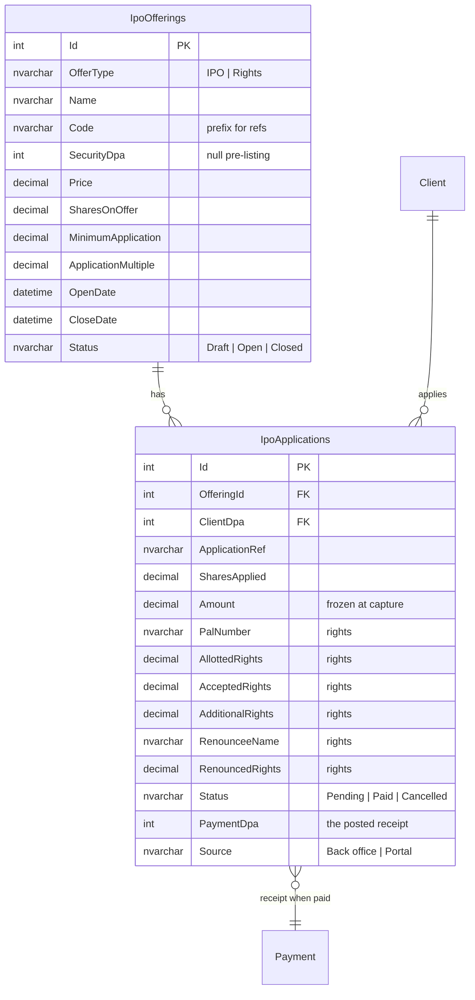
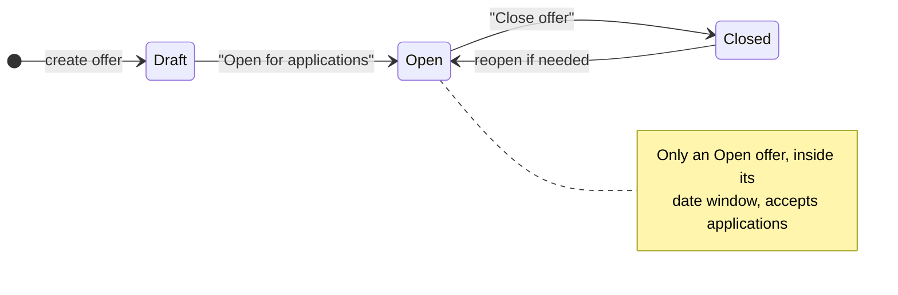
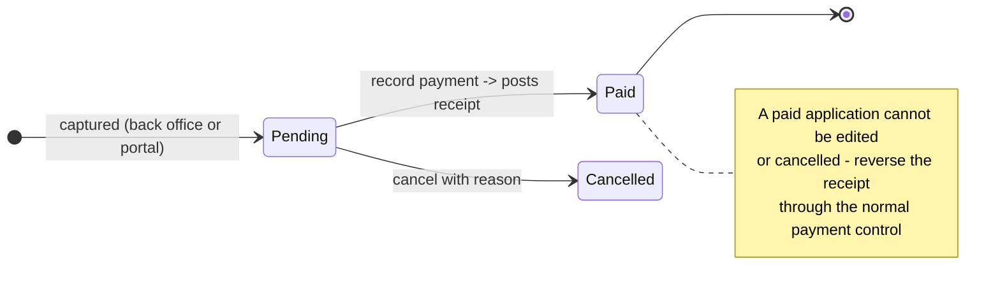
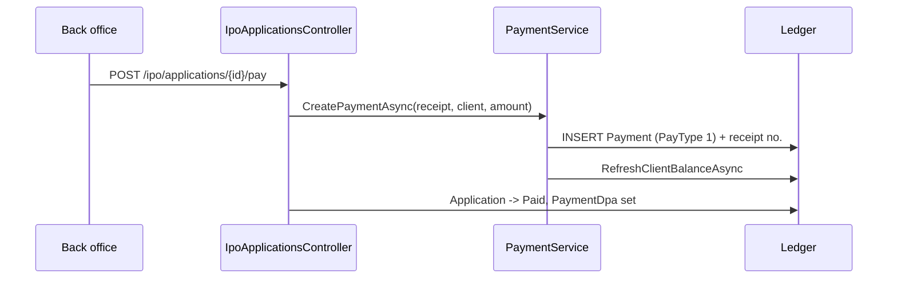

# IPOs & Rights Issues

How the IPO / Rights module works: what it stores, how money moves, and what is
deliberately **not** built yet.

> **Phase 1 (built).** Define an offer, capture applications against it (back
> office *and* client portal), take payment as a real receipt, export the
> register. Batching, cheque runs, bank files, allotment and refunds are Phase 2
> — see [Not built yet](#7-not-built-yet).

---

## 1. Why new tables

The legacy schema *looks* like it already supports IPOs. It does not.

| Legacy table | Cols | Rows in prod | What it actually is |
| --- | ---: | ---: | --- |
| `Offerings` | 77 | **1** (soft-deleted) | Client **applications**, rights-era |
| `OfferType` | 5 | 2 | `IPOS`, `RIGHTS` |
| `SecurityOffering` | 10 | 0 | Mirror of `Security` columns |
| `tblIPOsetup` | 3 | 0 | Loose key/value config |
| `BatchLog` | 4 | 0 | — |

Two problems made reuse the wrong call:

1. **There was never an offering master.** Nothing anywhere defined *"TNM Rights
   Issue 2026, price 9.60, opens 1 Sep, closes 30 Sep"*. `Offerings.Offering` is
   a bare `int` pointing at a record that exists in no table. The price, size and
   dates of an offer lived outside the system entirely.
2. **`Offerings` has no unambiguous "shares applied for" column.** It carries
   `Alloted_Rights` / `Accepted_Rights` (rights-specific) but nothing that
   plainly means "this client applied for N shares" in an IPO. Mapping it would
   have meant guessing the semantics of columns that no live row exercises.

With one soft-deleted row there was nothing to migrate, so Phase 1 uses two new
tables and leaves the legacy ones untouched.

---

## 2. Data model



Both tables are created idempotently at startup in `Program.cs` (same pattern as
`ContractAmendments` / `PaymentAlterations`) — no EF migration step to run.

**Notes on two fields that matter:**

- `Amount` is stored, not derived. It is `SharesApplied × Price` at the moment of
  capture, so a later correction to the offer price cannot silently restate what
  an applicant actually owed.
- `Price` on the offer is **locked once any application exists**, for the same
  reason.

---

## 3. Lifecycle





---

## 4. How the money works

This is the part worth reading carefully.

Recording payment posts a **real receipt** (`PayType 1`, `EntityType 1 = client`)
through `IPaymentService.CreatePaymentAsync` — the same path every other cash
receipt takes. It gets a receipt number, appears in the cash book, on the client
statement and in the payments register, and can be reversed through the existing
maker/checker reversal control.



### The withdrawable-cash guard

A receipt credits the client's balance. Left alone, that would mean a client
could pay for an IPO application and then **withdraw the same money** before the
broker forwards it to the issuer.

`ClientBalanceService.GetWithdrawableCashAsync` therefore now nets off
applications in `Paid` status:

```
withdrawable = currentBalance
             - pending withdrawal requests
             - paid IPO/Rights applications      <-- added for this module
```

So the money shows on the client's account (correct — it *was* received) but is
not available to withdraw (also correct — it is committed to the issuer).

> **For the PM:** the offsetting payment *out* to the receiving bank is not
> automated in Phase 1. Back office posts that as a normal payment when the funds
> are forwarded. Phase 2 (batching + cheque runs) is where that becomes one step.

---

## 5. Validation rules

Enforced server-side, so the portal cannot bypass them:

| Rule | Message |
| --- | --- |
| Offer must be `Open` | *"…is draft/closed and is not accepting applications."* |
| Application date within open/close window | *"The offer opens on / closed on …"* |
| Client exists and is not deleted | *"This client has been deleted and cannot apply."* |
| Shares ≥ `MinimumApplication` | *"The minimum application is N shares."* |
| Shares divisible by `ApplicationMultiple` | *"Applications must be in multiples of N shares."* |
| One live application per client per offer | *"This client already has an application for this offer."* |
| Rights: accepted ≤ allotted | *"Accepted rights cannot exceed the rights allotted."* |
| Rights: accepted + renounced ≤ allotted | *"Accepted plus renounced rights cannot exceed…"* |
| Rights: renouncing requires a renouncee name | *"Enter the name of the person the rights are renounced to."* |
| Price change after first application | *"The price cannot be changed once applications have been received."* |
| Delete an offer that has applications | *"This offer has applications and cannot be deleted. Close it instead."* |

---

## 6. Surfaces

### Back office (`brokerknow-web`)

| Route | Page | Purpose |
| --- | --- | --- |
| `/ipo/offerings` | `pages/Ipo/IpoOfferings.tsx` | Offer master: create/edit, open/close, per-offer totals |
| `/ipo/applications` | `pages/Ipo/IpoApplications.tsx` | Capture, edit, pay, cancel, CSV export |
| `/ipo/rights` | same component, `presetType="Rights"` | Rights-only view |

The remaining sidebar entries (batched/unbatched applications and forwards,
chequed/unchequed batches, batch summary) still render "Coming soon" — they are
Phase 2 views of the same `IpoApplications` rows sliced by batch.

### Client portal (`brokerknow-portal`)

`/offerings` — open offers as cards with price, close date, minimum and multiple;
an Apply dialog with a live "amount due"; and the client's own application
history.

A client **cannot** mark their own application paid. Portal submissions land as
`Pending` with `Source = "Portal"`; the back office confirms the money and posts
the receipt.

### Permissions

Two new pages in `PageCatalog`, deliberately on different areas:

| Key | Label | Area | Rationale |
| --- | --- | --- | --- |
| `ipo-offerings` | IPO & Rights Offers | `ReferenceData` | Setting up an offer is config work |
| `ipo-applications` | IPO & Rights Applications | `Orders` | Capturing a client application is front-office work |

Both appear in the Access Control grid under the "IPOs & Rights" group and honour
the usual View/Create/Edit/Delete capability masks.

---

## 7. API reference

**Back office** — `api/ipo/offerings`

| Verb | Route | Notes |
| --- | --- | --- |
| GET | `/` | `?search=&status=&type=` — includes application counts and money raised |
| GET | `/open` | Offers accepting applications now (drives pickers) |
| GET | `/{id}` | |
| POST | `/` | Creates as `Draft` |
| PUT | `/{id}` | Price locked once applications exist |
| POST | `/{id}/status` | `{ status: Draft \| Open \| Closed }` |
| DELETE | `/{id}` | Blocked once applications exist |

**Back office** — `api/ipo/applications`

| Verb | Route | Notes |
| --- | --- | --- |
| GET | `/` | `?offeringId=&status=&search=&page=&pageSize=` → `{ rows, total, totals }` |
| GET | `/{id}` | |
| POST | `/` | Amount computed from the offer price |
| PUT | `/{id}` | Unpaid applications only |
| POST | `/{id}/pay` | **Posts the receipt** |
| DELETE | `/{id}` | Cancel with reason; unpaid only |
| GET | `/export.csv` | Register for the receiving bank / registrar |

**Portal** — `api/portal` (role `Client`, scoped to the caller's `clientDpa`)

| Verb | Route |
| --- | --- |
| GET | `/ipo/offers` |
| GET | `/ipo/applications` |
| POST | `/ipo/apply` |

---

## 8. Not built yet

Phase 2, in the order the legacy workflow implies:

1. **Batching** — group applications into a numbered batch, close it, batch summary.
2. **Cheque / payment runs** — one payment out per batch to the receiving bank,
   replacing the manual offsetting payment described in §4.
3. **Bank / registrar export files** — the legacy `EFT*` and `Citi*` columns hint
   at a fixed-format file; no sample was available, so nothing was guessed.
4. **Allotment** — capture shares actually allotted per application.
5. **Refunds** — return the over-applied difference after allotment.
6. **Forwards** — the legacy `Forward` flag (applications forwarded to another
   broker) is not modelled; its exact meaning needs confirming with the PM.

Also open: whether allotted shares should post into `Holdings` automatically once
the security lists, and whether SMS/email notification on application is wanted
(the legacy table has `sms` / `ISSMSSend` columns).
