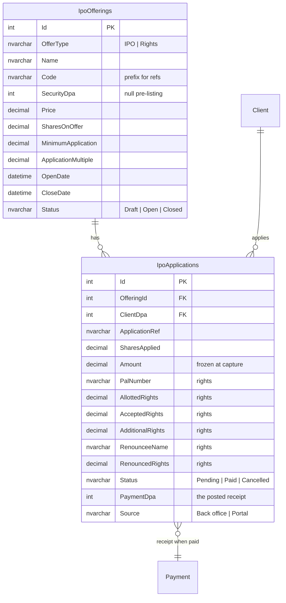
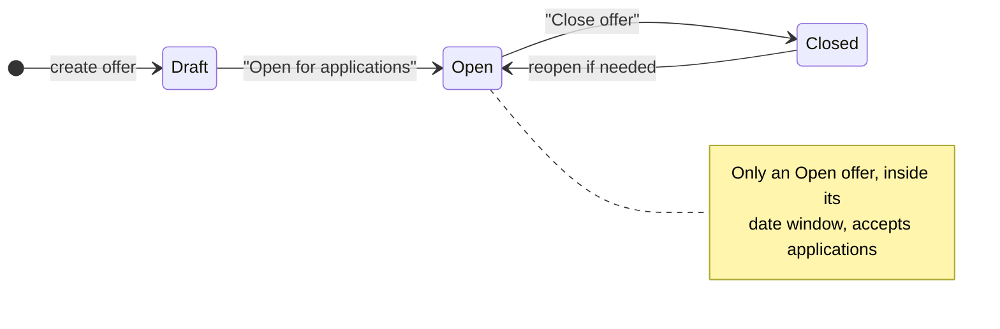
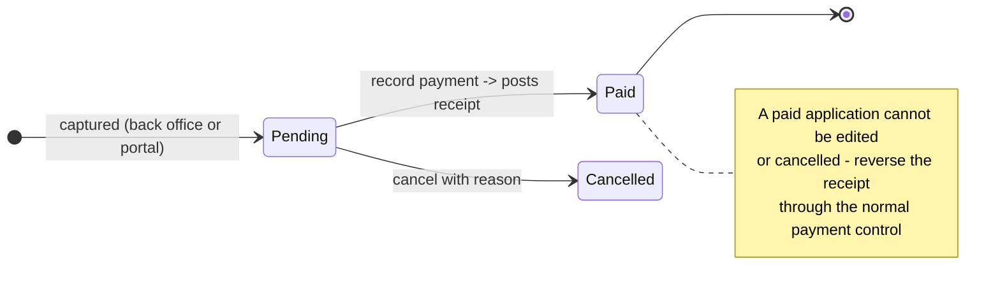
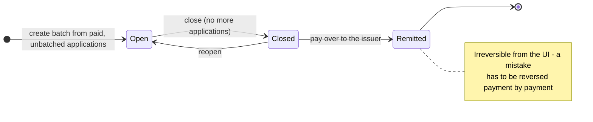
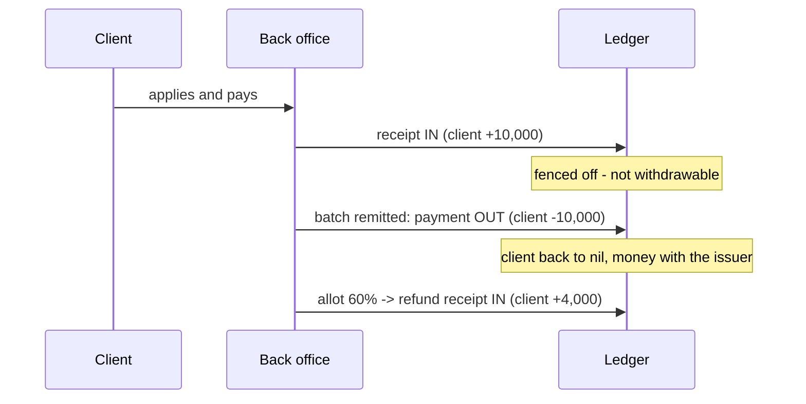

# IPOs & Rights Issues

How the IPO / Rights module works: what it stores, how money moves, and what is
deliberately **not** built yet.

> **Phase 1 + 2 (built).** Define an offer, capture applications (back office
> *and* client portal), take payment as a real receipt, batch applications, pay
> the batch over to the issuer, export the schedule, record the allotment and
> pay refunds. Remaining gaps are in [Not built yet](#9-not-built-yet).

---

## 1. Why new tables

The legacy schema *looks* like it already supports IPOs. It does not.

| Legacy table | Cols | Rows in prod | What it actually is |
| --- | ---: | ---: | --- |
| `Offerings` | 77 | **1** (soft-deleted) | Client **applications**, rights-era |
| `OfferType` | 5 | 2 | `IPOS`, `RIGHTS` |
| `SecurityOffering` | 10 | 0 | Mirror of `Security` columns |
| `tblIPOsetup` | 3 | 0 | Loose key/value config |
| `BatchLog` | 4 | 0 | — |

Two problems made reuse the wrong call:

1. **There was never an offering master.** Nothing anywhere defined *"TNM Rights
   Issue 2026, price 9.60, opens 1 Sep, closes 30 Sep"*. `Offerings.Offering` is
   a bare `int` pointing at a record that exists in no table. The price, size and
   dates of an offer lived outside the system entirely.
2. **`Offerings` has no unambiguous "shares applied for" column.** It carries
   `Alloted_Rights` / `Accepted_Rights` (rights-specific) but nothing that
   plainly means "this client applied for N shares" in an IPO. Mapping it would
   have meant guessing the semantics of columns that no live row exercises.

With one soft-deleted row there was nothing to migrate, so Phase 1 uses two new
tables and leaves the legacy ones untouched.

### What the legacy schema *did* tell us

The view definitions survive and they are a usable specification:

| Legacy view | What it proves |
| --- | --- |
| `BatchedApplications` | A batch summary is `Batch_No, TotalNo, SecurityName, TotalQty, TotalAmt, ClosingDate` |
| `BatchedForwards` | The same, plus a `Forward` flag — two parallel streams |
| `ForwardsList` | Carries `ReceivingBroker` + `BrokerName`, so **a "forward" is an application passed to another broker** |
| `EditOffering` | Joins `Payment` to the application (`Payment_DPA_`, `PaymentReceiptNo`, `BankAccount_DPA_`) — confirming **one receipt per application** |
| `OfferingList` | `BatchSeq`, `BatchSize`, `BatchClosed`, `OfferCheque`, `RefundMethod`, `Downloaded`, `BatchFileName` |

`BatchFileName` was **never once populated** across the whole table, so no
historic export layout exists to copy.

---

## 2. Data model



Both tables are created idempotently at startup in `Program.cs` (same pattern as
`ContractAmendments` / `PaymentAlterations`) — no EF migration step to run.

**Notes on two fields that matter:**

- `Amount` is stored, not derived. It is `SharesApplied × Price` at the moment of
  capture, so a later correction to the offer price cannot silently restate what
  an applicant actually owed.
- `Price` on the offer is **locked once any application exists**, for the same
  reason.

---

## 3. Lifecycle





### Batches



Only **paid** applications can be batched: the batch is a request for money to
go to the issuer, so an unpaid application has nothing to send. Own-book
applications and forwards never mix in the same batch.

---

## 4. How the money works

This is the part worth reading carefully. Every step was checked against how
Cedar actually booked past issues:

| Historic payment | PayType | Entity | What it was |
| --- | --- | --- | --- |
| 3331 “Purchase of NBS Rights” | 1 in | Client | Client paying for an application |
| 3335 / 3336 “NBS Rights Issue Payment” MWK 13.3m | 2 out | Nominal **NBSR** | Lump remittance to the issuer |
| 11448 “Purchase of 40,000 FDH IPO shares” | 2 out | Client | Per-client debit |
| 11055 “Refund from Airtel IPO” | 1 in | Client | Refund coming back |

### 4.1 Client pays

Recording payment posts a **real receipt** (`PayType 1`, `EntityType 1 = client`)
through `IPaymentService.CreatePaymentAsync` — the same path every other cash
receipt takes. It gets a receipt number, appears in the cash book, on the client
statement and in the payments register, and can be reversed through the existing
maker/checker control.

### 4.2 Batch is paid over to the issuer

One payment out (`PayType 2`) **per client**, not a single lump.

Cedar's history shows both shapes, but only the per-client form clears each
client's balance. A lump to the NBSR nominal account would leave every applicant
showing credit for money that has already gone to the issuer. The receiving
account is still recorded on the batch for the issuer's paperwork.

### 4.3 Refunds

A receipt back to the client (`PayType 1`) for `(applied - allotted) x price`,
matching how the Airtel IPO refund was booked.



### The withdrawable-cash guard

A receipt credits the client's balance. Left alone, that would mean a client
could pay for an IPO application and then **withdraw the same money** before the
broker forwards it to the issuer.

`ClientBalanceService.GetWithdrawableCashAsync` therefore nets off applications
that are paid **but not yet remitted**:

```
withdrawable = currentBalance
             - pending withdrawal requests
             - paid, unremitted IPO/Rights applications
```

Once the batch is remitted the payment out has already reduced the balance, so
continuing to net it off would deduct the same money twice.

> **Footgun worth knowing.** That guard initially blocked the remittance itself —
> the remittance is a `PayType 2` payment to a client, so it hit the same
> over-payment check that fences the money. `CreatePaymentRequest` now carries
> `IsCommittedTransfer`, set **only** by the remittance path, to move money the
> broker already holds for the client. Ordinary withdrawals are unaffected.

---

## 5. Validation rules

Enforced server-side, so the portal cannot bypass them:

| Rule | Message |
| --- | --- |
| Offer must be `Open` | *"…is draft/closed and is not accepting applications."* |
| Application date within open/close window | *"The offer opens on / closed on …"* |
| Client exists and is not deleted | *"This client has been deleted and cannot apply."* |
| Shares ≥ `MinimumApplication` | *"The minimum application is N shares."* |
| Shares divisible by `ApplicationMultiple` | *"Applications must be in multiples of N shares."* |
| One live application per client per offer | *"This client already has an application for this offer."* |
| Rights: accepted ≤ allotted | *"Accepted rights cannot exceed the rights allotted."* |
| Rights: accepted + renounced ≤ allotted | *"Accepted plus renounced rights cannot exceed…"* |
| Rights: renouncing requires a renouncee name | *"Enter the name of the person the rights are renounced to."* |
| Price change after first application | *"The price cannot be changed once applications have been received."* |
| Delete an offer that has applications | *"This offer has applications and cannot be deleted. Close it instead."* |
| Only paid applications can be batched | *"No paid, unbatched applications are available for this offer."* |
| Remit before closing the batch | *"Close the batch before paying it over."* |
| Remitting twice | *"Batch N has already been paid to the issuer."* |
| Allotting more than applied for | *"X cannot be allotted more than the N shares applied for."* |
| Refunding twice | returns `refunded: 0` — a paid refund is skipped |
| Forwarding an already-batched application | *"X is already in a batch. Remove it from the batch first."* |
| Deleting a remitted batch | *"A batch that has been paid to the issuer cannot be deleted."* |

---

## 6. Surfaces

### Back office (`brokerknow-web`)

All nine sidebar entries are live. Three page components back them, because the
legacy screens are the same rows under different filters:

| Route | Component | Filter |
| --- | --- | --- |
| `/ipo/offerings` | `IpoOfferings.tsx` | Offer master |
| `/ipo/applications` | `IpoApplications.tsx` | all |
| `/ipo/rights` | `IpoApplications.tsx` | `presetType="Rights"` |
| `/ipo/unbatched-applications` | `IpoApplications.tsx` | `batched=false, forward=false` |
| `/ipo/batched-applications` | `IpoApplications.tsx` | `batched=true, forward=false` |
| `/ipo/unbatched-forwards` | `IpoApplications.tsx` | `batched=false, forward=true` |
| `/ipo/batched-forwards` | `IpoApplications.tsx` | `batched=true, forward=true` |
| `/ipo/batch-summary` | `IpoBatches.tsx` | all batches |
| `/ipo/chequed-batches` | `IpoBatches.tsx` | `remitted=true` |
| `/ipo/unchequed-batches` | `IpoBatches.tsx` | `remitted=false` |

"Chequed" means the batch has been paid over to the issuer.

### Client portal (`brokerknow-portal`)

`/offerings` — open offers as cards with price, close date, minimum and multiple;
an Apply dialog with a live "amount due"; and the client's own application
history.

A client **cannot** mark their own application paid. Portal submissions land as
`Pending` with `Source = "Portal"`; the back office confirms the money and posts
the receipt.

### Permissions

Two new pages in `PageCatalog`, deliberately on different areas:

| Key | Label | Area | Rationale |
| --- | --- | --- | --- |
| `ipo-offerings` | IPO & Rights Offers | `ReferenceData` | Setting up an offer is config work |
| `ipo-applications` | IPO & Rights Applications | `Orders` | Capturing a client application is front-office work |

Both appear in the Access Control grid under the "IPOs & Rights" group and honour
the usual View/Create/Edit/Delete capability masks.

---

## 7. API reference

**Back office** — `api/ipo/offerings`

| Verb | Route | Notes |
| --- | --- | --- |
| GET | `/` | `?search=&status=&type=` — includes application counts and money raised |
| GET | `/open` | Offers accepting applications now (drives pickers) |
| GET | `/{id}` | |
| POST | `/` | Creates as `Draft` |
| PUT | `/{id}` | Price locked once applications exist |
| POST | `/{id}/status` | `{ status: Draft \| Open \| Closed }` |
| DELETE | `/{id}` | Blocked once applications exist |

**Back office** — `api/ipo/applications`

| Verb | Route | Notes |
| --- | --- | --- |
| GET | `/` | `?offeringId=&status=&search=&page=&pageSize=` → `{ rows, total, totals }` |
| GET | `/{id}` | |
| POST | `/` | Amount computed from the offer price |
| PUT | `/{id}` | Unpaid applications only |
| POST | `/{id}/pay` | **Posts the receipt** |
| POST | `/allot` | Explicit lines, or `scaleFactor` + `offeringId` for a scale-back |
| POST | `/refund` | **Posts refund receipts**; skips anything already refunded |
| POST | `/forward` | Mark/clear "passed to another broker" |
| DELETE | `/{id}` | Cancel with reason; unpaid only |
| GET | `/export.csv` | Register for the receiving bank / registrar |

**Back office** — `api/ipo/batches`

| Verb | Route | Notes |
| --- | --- | --- |
| GET | `/` | `?offeringId=&status=&forward=&remitted=` — count, quantity, value, allotted, refund per batch |
| GET | `/{id}` | |
| POST | `/` | Opens a batch and takes every eligible paid, unbatched application |
| POST | `/{id}/add` | Add more applications |
| POST | `/{id}/remove` | Take applications back out |
| POST | `/{id}/close` | No more applications; ready to remit |
| POST | `/{id}/reopen` | Only while unremitted |
| POST | `/{id}/remit` | **Posts one payment out per client** |
| GET | `/{id}/export.csv` | The issuer's application schedule |
| DELETE | `/{id}` | Empty, unremitted batches only |

**Portal** — `api/portal` (role `Client`, scoped to the caller's `clientDpa`)

| Verb | Route |
| --- | --- |
| GET | `/ipo/offers` |
| GET | `/ipo/applications` |
| POST | `/ipo/apply` |

---

## 8. Working an offer end to end

1. **Offerings** → create the offer, then *Open for applications*.
2. **Applications** → capture them (or let clients apply in the portal), then
   *Record payment* on each. Optionally *Forward to broker* for any that another
   broker is submitting.
3. **Batch Summary** → *New batch*. Every paid, unbatched application for the
   offer joins it.
4. *Close batch*, then **Export schedule** for the issuer.
5. *Pay over to issuer* — posts the client payments and marks the batch
   **Remitted** (it then appears under Chequed Batches).
6. When the issuer announces the result, **Record allotment** (a percentage for
   a scaled-back issue, or exact figures per application).
7. **Pay refunds** for the shortfall.

---

## 9. Not built yet

1. **A real bank/registrar file layout.** The export is a labelled CSV. The
   legacy `BatchFileName` column was never populated in the entire table, so
   there is no historic format to copy and none was invented. The legacy
   `EFT*` and `Citi*` columns suggest a fixed-width layout once existed; if the
   issuer supplies a spec, only the CSV writer needs replacing.
2. **Allotted shares do not post into `Holdings`.** The allotment is recorded on
   the application but no holding is created — that needs the security to be
   listed with a CDS number, and confirmation of which CDS date to use.
3. **Refund by cheque/EFT is recorded, not executed.** `RefundMethod` is stored
   and the receipt is posted to the client account; producing an actual cheque
   run or EFT file is not built. The legacy `EFTBankRef` / `EFTSortCode` /
   `EFTAccountNo` columns show where those details used to live.
4. **Remittance cannot be undone in one click.** Reversing a batch means
   reversing each client payment through the normal reversal control.
5. **No SMS/email notification** on application or allotment (the legacy table
   has `sms` / `ISSMSSend` columns).

### One decision for the PM

The remittance posts **one payment out per client**. Cedar's own history also
shows a single lump to the NBS Bank Rights Issue Account (a nominal account).
Per-client was chosen because it is the only form that clears each client's
balance — a lump would leave every applicant showing credit for money already
sent to the issuer. If the accountant wants the cash book to show one lump line
instead, that is a reporting change, and the client-side entries still have to
happen somewhere.
