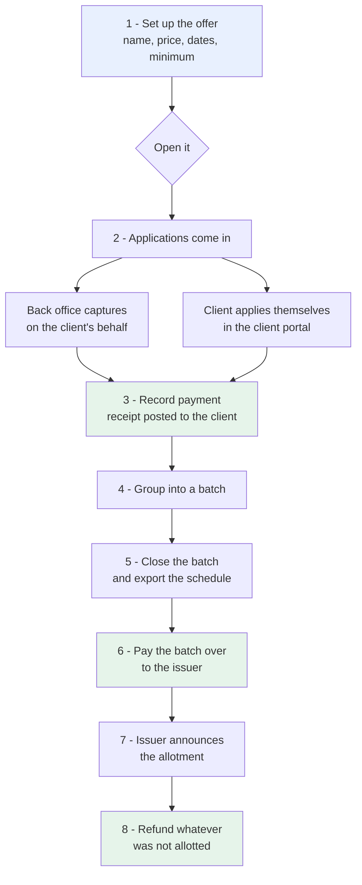
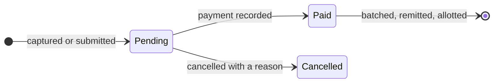
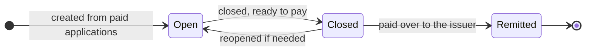
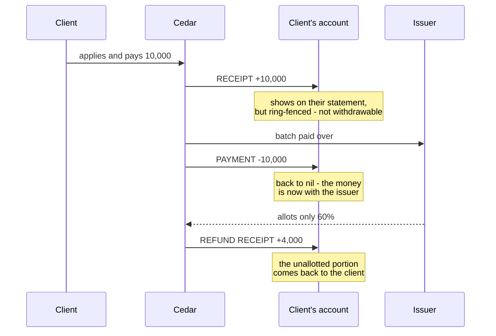

# IPOs & Rights Issues — What Has Been Built

**For:** Project Manager / Cedar Capital
**Status:** Live in production
**Date:** 10 August 2026

---

## 1. In one paragraph

The system can now run a public offer end to end: set up the offer, take
applications from clients (captured by the back office *or* submitted by clients
themselves in the portal), collect the money as a proper receipt on the client's
account, group applications into batches for the issuer, pay each batch over,
record what the issuer actually allotted, and refund the difference. All ten
menu items under **IPOs & Rights** are working — none say "Coming soon" any more.

---

## 2. The full journey

The green steps are the ones that move money. Each posts a real entry to the
client's account, so everything shows on their statement and in the cash book.

---

## 3. Where each menu item fits

| Menu item | What it is for |
| --- | --- |
| **Offerings** | Set up and manage each offer — name, type, price, dates, minimum application, receiving bank. Open and close the offer here. |
| **Applications** | Every application, with capture, edit, payment, cancellation and CSV export. |
| **Right Issues** | The same screen, filtered to rights issues only. |
| **Unbatched Applications** | Paid applications not yet grouped — your working list when preparing a batch. |
| **Batched Applications** | Applications already in a batch. |
| **Unbatched Forwards** | Applications being passed to another broker, not yet grouped. |
| **Batched Forwards** | Forwarded applications already grouped. |
| **Batch Summary** | Every batch with its count, shares, value, allotment and refund due. |
| **Unchequed Batches** | Batches not yet paid over to the issuer. |
| **Chequed Batches** | Batches already paid over. |

---

## 4. How an application progresses

Once an application is paid it can no longer be edited or cancelled — correcting
it means reversing the receipt through the normal payment-reversal control, so
the audit trail stays intact.

## 5. How a batch progresses

Only **paid** applications can go into a batch — the batch is a request for money
to go to the issuer, so an unpaid application has nothing to send. Applications
the broker submits itself and those forwarded to another broker are never mixed
in the same batch.

---

## 6. How the money moves

This is the part worth reviewing with the accountant.

Three points to confirm with the accountant:

1. **Money in is a real receipt**, not a note in a field. It gets a receipt
   number and appears in the cash book, on the client statement and in the
   payments register, exactly like any other receipt.
2. **Ring-fencing.** Money paid for an offer is deliberately excluded from the
   client's withdrawable balance. Without this a client could pay for an offer
   and then withdraw the same money before Cedar forwards it to the issuer.
3. **The remittance posts one payment per client**, not a single lump sum.
   Cedar's own history shows both approaches, but only the per-client form clears
   each client's balance — a single lump would leave every applicant still
   showing credit for money that has already gone to the issuer. *If the
   accountant would rather see one line in the cash book, please say so.*

---

## 7. Controls built in

The system refuses these, with a plain-English message each time:

| Attempt | Why it is blocked |
| --- | --- |
| Applying to an offer that is not open | Only an open offer, inside its dates, accepts applications |
| Applying for fewer than the minimum, or off the multiple | Enforces the offer's own terms |
| The same client applying twice to one offer | Keeps the register unambiguous |
| Changing the price after applications exist | Would restate what applicants already owed |
| Batching an unpaid application | There is no money to send |
| Paying a batch over before closing it | The batch must be final first |
| Paying the same batch over twice | Prevents double payment |
| Allotting more shares than were applied for | Arithmetic guard |
| Refunding twice | Already-refunded applications are skipped |
| Editing or cancelling a paid application | Must go through the receipt reversal control |
| Deleting an offer or batch with activity | Protects the audit trail |
| A client marking their own application paid | Only the back office confirms money |

Rights issues additionally check that accepted rights do not exceed those
allotted, and that renouncing to someone requires naming them.

---

## 8. What clients see in the portal

A new **IPOs & Rights** section showing each open offer as a card — price,
closing date, minimum and any multiple — with an Apply form that calculates the
amount due as they type, plus a list of their own applications and status.

Applications from the portal arrive as **Pending**. The client cannot mark their
own application paid; the back office confirms the money and posts the receipt.

---

## 9. Not built yet

Honest list of what is still outside the system:

| Gap | Note |
| --- | --- |
| **Issuer's file format** | The export is a clear labelled spreadsheet. The old system had a field for a batch file name but it was **never once used**, so there is no historic format to copy and none was invented. If the issuer or registrar states a required layout, only the export needs changing. |
| **Allotted shares do not create holdings** | The allotment is recorded against the application; it does not yet create a holding. That needs the security to be listed with a CDS number, and a rule for which date to use. |
| **Cheque / EFT refunds are recorded, not produced** | The refund is posted to the client's account and the method is stored, but the system does not yet produce a cheque run or bank file. |
| **Undoing a remittance** | Reversing a batch means reversing each client payment through the normal control — there is no one-click undo, deliberately. |
| **Notifications** | No SMS or email is sent on application or allotment. |

---

## 10. What we need from you

1. **Confirm the money treatment** in section 6 with the accountant — in
   particular per-client versus a single lump remittance.
2. **The issuer's required file layout**, if there is one, so the export can be
   shaped to it rather than guessed.
3. **Whether allotted shares should post into holdings automatically**, and from
   which date.
4. **Whether clients should be notified** on application and on allotment.

---

## 11. Trying it out

Menu: **IPOs & Rights**. A sensible first run:

1. *Offerings* → **New offer** → fill in name, price, dates, minimum → save →
   **Open for applications**
2. *Applications* → **New application** → pick the offer and client, enter shares
   → the amount due calculates as you type
3. **Record payment** on that application → choose the bank account and method
4. *Batch Summary* → **New batch** → **Close** → **Export schedule** →
   **Pay over to issuer**
5. *Applications* → **Record allotment** (e.g. 60% for a scaled-back issue) →
   **Pay refunds**

Access is controlled separately for setting up offers versus capturing
applications, so the two jobs can sit with different people.
