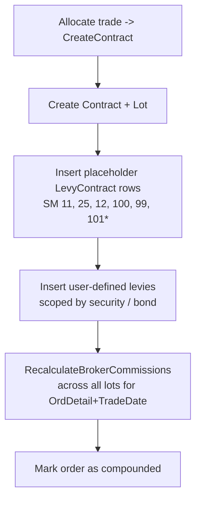

# BrokerKnow — Levy Calculations

**Companion to:** [Levy_Setup_And_Usage.md](Levy_Setup_And_Usage.md)
**Audience:** Engineers, finance/ops, auditors
**Last updated:** June 2026

This document describes **how each levy is computed** when a trade is
allocated, how the values are stored in `dbo.LevyContract`, and how the
reports re-shape those rows for display. It mirrors the .NET
implementation in
[ContractService.cs](../../brokerknow-api/src/BrokerKnow.Application/Contracts/ContractService.cs)
and
[CommissionCalculator.cs](../../brokerknow-api/src/BrokerKnow.Application/Commissions/CommissionCalculator.cs),
which themselves replicate the legacy SPs `cont_CreateContract` and
`cont_RedoBrokerCommissions`.

---

## 1. Inputs to every calculation

| Symbol | Source | Notes |
|---|---|---|
| `gross` | `Lot.LotGrossAmount` | `Quantity × Price`, rounded to 2 dp |
| `totalGross` | Σ `gross` for all lots on the same `OrdDetail` + trade date | Used for tiered commission bands |
| `side` | `Order.OrderType` first letter | `"P"` Purchase, `"S"` Sale |
| `vatRate` | `Levy.LevyAmount` where `SystemMaintained = 99` | Percentage, e.g. `16.5` |
| Client commission profile | `Client.Commission` | Tier rates, boundaries, minimum |
| Agent commission rate | `Client.Agent.Commission.CommissionRate` | Percentage; 0 if no agent |

---

## 2. Reserved `SystemMaintained` codes

These codes drive the calculation engine. Anything *not* on this list is
treated as a user-defined levy (see §6).

| SM | Name | Role |
|---|---|---|
| 10 | Stamps | Carried out of client Net (broker-paid) |
| 11 | Broker Commission | 3-tier band on `totalGross` |
| 12 | Agent Commission | % of (Broker Comm − MSE), broker-paid |
| 25 | MSE Commission | % of Broker Comm, broker-paid |
| 99 | VAT | Placeholder; mirrors Σ `LevyVatAmount` on SM 11 + 100 |
| 100 | Handling / Basic Fee | Flat amount on the **last** lot only |
| 101 | CGT | Sale side only, % of `gross` |

`LevyContract` carries two amount columns:
* `LevyAmount` — the principal charge for the row.
* `LevyVatAmount` — VAT charged on that row (zero when the row is itself a tax or carve-out).

---

## 3. Order of operations



`*` SM 101 (CGT) is only inserted on **sale** contracts.

---

## 4. The six engine-managed levies

All formulas below are evaluated *per `OrdDetail` per trade date*, then
distributed across the constituent lots proportionally by
`lot.gross / totalGross`. The last lot always absorbs the rounding
remainder so that Σ lot amounts = the calculated total exactly.

### 4.1 Broker Commission — SM 11

3-tier band against `totalGross` using the client's `Commission` profile:

$$
\text{Comm} = b_1 \cdot r_1 + b_2 \cdot r_2 + b_3 \cdot r_3
$$

where

$$
\begin{aligned}
b_1 &= \min(\text{totalGross},\ B_1) \\
b_2 &= \begin{cases}
  B_2 - B_1 & \text{totalGross} > B_2 \\
  \text{totalGross} - B_1 & B_1 < \text{totalGross} \le B_2 \\
  0 & \text{otherwise}
\end{cases} \\
b_3 &= \max(\text{totalGross} - B_2,\ 0)
\end{aligned}
$$

* $B_1$ = `SecurityBoundary`, $B_2$ = `SecondSecurityBoundary`
* $r_1$ = `CommissionRate`, $r_2$ = `MedianSecurityCommission`, $r_3$ = `UpperSecurityCommission` (rates are percentages, divided by 100 at use)

**Floor:** if `Comm < MinimumSecurityCommission`, then
`Comm = MinimumSecurityCommission` and `LevyRatePercentage = "Minimum"`.

**VAT on broker comm:** `BrokerVat = round(Comm × vatRate / 100, 2)` and is stored on the SM=11 row's `LevyVatAmount`.

For **bonds** the same formula uses `BondCommission`, `MedianBondCommission`, `UpperBondCommission`, `BondBoundary`, `SecondBondBoundary`, `MinimumBondCommission` — see `CalculateBondCommission`.

### 4.2 MSE Commission — SM 25

A slice **carved out of broker commission**:

$$
\text{MSE} = \text{round}\!\left(\frac{r_{\text{mse}}}{100}\cdot \text{Comm},\ 2\right)
$$

$$
\text{MseVat} = \text{round}\!\left(\text{MSE}\cdot \frac{\text{vatRate}}{100},\ 2\right)
$$

`r_mse` = `Levy.LevyAmount` where `SystemMaintained = 25`.

> **Important:** `Comm` (SM=11) is stored **gross of MSE**. MSE is a
> separate row representing the regulator's slice. The Traded Levies
> report subtracts MSE from the Commission column for display (see §7).

### 4.3 Agent Commission — SM 12

% of broker comm net of MSE; **broker-paid** (does not affect client Net):

$$
\text{Agent} = \text{round}\!\left(\frac{r_{\text{agent}}}{100}\cdot(\text{Comm} - \text{MSE}),\ 2\right)
$$

`r_agent` = the client's agent commission rate (0 if no agent). VAT on agent commission is stored as 0.

### 4.4 Handling / Basic Fee — SM 100

Flat fee, placed on the **last** lot of the order only:

$$
\text{Handling} = \text{Levy.LevyAmount where SM}=100
$$

$$
\text{HandlingVat} = \text{round}\!\left(\text{Handling}\cdot\frac{\text{vatRate}}{100},\ 2\right)
$$

All other lots in the same group have their SM=100 row zeroed.

### 4.5 VAT — SM 99

The SM=99 row is **derived**, not an independent charge. After all other
rows are written, each contract's SM=99 `LevyAmount` is overwritten as:

$$
\text{VAT}_{99} = \text{round}\!\left(\sum_{\text{SM}\in\{11,100\}} \text{LevyVatAmount},\ 2\right)
$$

i.e. it mirrors the total VAT already accounted for on the broker comm
and handling fee rows. This row exists so legacy reports can show a
"VAT" cell; the **authoritative** VAT figures live on each row's
`LevyVatAmount`.

### 4.6 CGT — SM 101 (sales only)

$$
\text{CGT} = \text{round}\!\left(\text{gross}\cdot\frac{r_{\text{cgt}}}{100},\ 2\right)
$$

`r_cgt` = `Levy.LevyAmount` where `SystemMaintained = 101`. No VAT on CGT.

---

## 5. Proportional distribution across lots

For each engine-managed levy that has a single per-`OrdDetail` total
(SM 11, 25, 12), the total is split across the contributing lots:

```text
for each entry i:
    proportion_i = round(lot_i.gross / totalGross, 2)
    if i < last:
        entry_i.LevyAmount    = round(proportion_i * totalAmount, 2)
        entry_i.LevyVatAmount = round(proportion_i * totalVat,    2)
    else:
        entry_i.LevyAmount    = totalAmount - sum(previous LevyAmounts)
        entry_i.LevyVatAmount = totalVat    - sum(previous LevyVatAmounts)
```

This guarantees Σ lot levies equals the calculated total exactly, with
the last lot absorbing rounding drift.

---

## 6. User-defined levies

Any `dbo.Levy` row that is `LevyActive = 1` and whose `SystemMaintained`
is **not** in `{11, 12, 25, 99, 100, 101}` is treated as a user-defined
levy. Scope rules (mirroring legacy):

1. Must apply to the contract's instrument class:
   * Bond contract → `LevyAppBond = 1`
   * Otherwise → `LevyAppSecurity = 1`
2. Per-security scope via `dbo.LevySecurity`:
   * No rows → applies to **all** securities.
   * Has rows → applies **only** to the listed `SecurityDpa`s.

For each matching levy:

| `LevyType` | Amount formula | `LevyRatePercentage` stored |
|---|---|---|
| `P` (percentage) | `round(gross × LevyAmount / 100, 2)` | `"{LevyAmount}%"` |
| `S` (scalar / flat) | `LevyAmount` | `LevyAmount.ToString("0.##")` |

VAT is applied when `Levy.Vatable ∈ {"1", "true", "yes"}`:

$$
\text{LevyVat} = \text{round}\!\left(\text{amount}\cdot\frac{\text{vatRate}}{100},\ 2\right)
$$

User-defined levies are written once at `CreateContract` time and are
**not** recalculated by `RecalculateBrokerCommissions`.

---

## 7. Report semantics (Traded Levies, Single-Client Compounded)

The raw `LevyContract` rows have to be re-shaped for the on-screen /
PDF tables. The transformation matches legacy view
`ContractLeviesCrossTab`:

| Column | Source |
|---|---|
| **Commission** | `(SM=11).LevyAmount − (SM=25).LevyAmount` |
| **MSEComm** | `(SM=25).LevyAmount` (informational; already carved out above) |
| **Agent** | `(SM=12).LevyAmount` (informational; broker-paid) |
| **Stamps** | `(SM=10).LevyAmount` (informational; broker-paid) |
| **Basic / Handling** | `(SM=100).LevyAmount` |
| **CGT** | `(SM=101).LevyAmount` |
| **VAT** | `Σ LevyVatAmount across all non-99 rows` |
| *Any other* | `LevyAmount` grouped by `LevyShortName` |

The SM=99 placeholder row is **not** rendered as its own cell — its
`LevyAmount` is a recomputed mirror and would double-show against the
aggregated VAT column.

### 7.1 Client Net

Net is what the client actually pays (purchase) or receives (sale).
Broker-paid carve-outs are excluded:

$$
\text{clientLevies} = \Big(\sum_{\text{SM}\notin\{10,12,25\}} \text{LevyAmount}\Big) + \sum \text{LevyVatAmount}
$$

$$
\text{Net} = \begin{cases}
\text{gross} - \text{clientLevies} & \text{side} = S \\
\text{gross} + \text{clientLevies} & \text{side} = P
\end{cases}
$$

Notes:
* SM=99 is excluded from the `LevyAmount` sum (its `LevyAmount` is a mirror; VAT is already captured by the `LevyVatAmount` sum).
* SM 10 (Stamps), 12 (Agent), 25 (MSE) are broker-paid and never hit client Net.
* SM 11 (Broker Comm) **does** hit client Net — it's the client's commission charge.

---

## 8. Worked example

Client buys 1,000 shares @ MWK 15.00 → `gross = 15,000.00`. Broker
profile: tier 1 = 2.35% on the first 25,000,000; MSE rate = 16.67%;
agent rate = 0%; handling = 58.75 flat; VAT = 16.5%; no CGT (purchase).

| Step | Value |
|---|---|
| Broker Comm (SM 11) | `15,000 × 2.35% = 352.50` |
| Broker VAT (on SM 11) | `352.50 × 16.5% = 58.16` |
| MSE (SM 25) | `352.50 × 16.67% = 58.76` |
| Agent (SM 12) | `0` |
| Handling (SM 100) | `58.75` |
| Handling VAT (on SM 100) | `58.75 × 16.5% = 9.69` |
| VAT mirror (SM 99) | `58.16 + 9.69 = 67.85` |

**Report row:**

| Gross | Commission | MSEComm | Basic | VAT | Net |
|---:|---:|---:|---:|---:|---:|
| 15,000.00 | `352.50 − 58.76 = 293.74` | 58.76 | 58.75 | 67.85 | 15,000 + (352.50 + 58.75 + 67.85) = **15,479.10** |

(Agent and MSE do *not* enter Net — they are paid out of the broker
commission.)

---

## 9. Reference

* Engine: [ContractService.cs](../../brokerknow-api/src/BrokerKnow.Application/Contracts/ContractService.cs) — `CreateContractAsync`, `RecalculateBrokerCommissions`, `UpdateLevyContractProportionally`, `InsertUserDefinedLevies`.
* Banded commission: [CommissionCalculator.cs](../../brokerknow-api/src/BrokerKnow.Application/Commissions/CommissionCalculator.cs) — `CalculateSecurityCommission`, `CalculateBondCommission`, `CalculateTieredCommission`.
* Report shaping: [ReportsController.cs](../../brokerknow-api/src/BrokerKnow.Api/Controllers/ReportsController.cs) — `BuildTradedLeviesAsync`.
* Setup workflow & UI: [Levy_Setup_And_Usage.md](Levy_Setup_And_Usage.md).
* Legacy SPs: [sp_cont_CreateContract.sql](../Legacy_System/sp_cont_CreateContract.sql), [sp_cont_RedoBrokerCommissions.sql](../Legacy_System/sp_cont_RedoBrokerCommissions.sql), [view_ClientStatement.sql](../Legacy_System/view_ClientStatement.sql).
