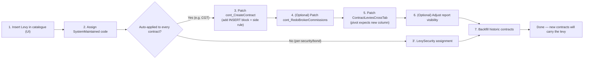
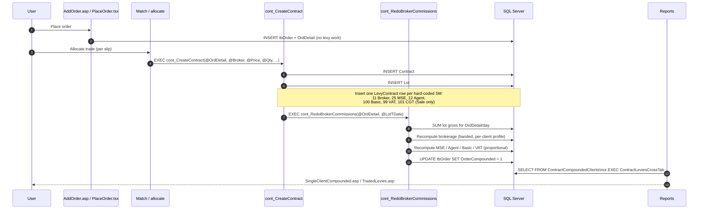

# BrokerKnow — Creating a Levy and Using It on an Order

**Database:** TEST_Malawi / PROD_Malawi (SQL Server)
**Application:** BrokerKnow (Classic ASP)
**Audience:** System administrators, support engineers
**Last updated:** May 2026

> Diagrams below are Mermaid; render natively in GitHub, VS Code (Markdown
> Preview Mermaid extension) and Confluence's Mermaid macro.

---

## 0. Levy at a glance

```mermaid
flowchart LR
    Catalogue[(Levy table\n+ LevySecurity\n+ LevyOrderList)]
    Profile[(Commission profile\nper Client / Agent)]
    SetupUI["Admin → Levies / Commissions"]
    SetupUI --> Catalogue
    SetupUI --> Profile

    subgraph Trade
        Match[Trade matched\n(per slip)]
        SP[cont_CreateContract]
        Redo[cont_RedoBrokerCommissions]
        Match --> SP --> Redo
    end
    Catalogue --> SP
    Profile --> Redo
    SP --> LC[(LevyContract\none row per SystemMaintained)]
    Redo --> LC

    subgraph Reports
        TL[TradedLevies.asp]
        SCC[SingleClientCompounded.asp]
        XT[ContractLeviesCrossTab view]
    end
    LC --> XT --> TL
    LC --> SCC
```

---

## 1. Concept overview

A **Levy** in BrokerKnow is any charge attached to a contract — broker commission, MSE commission, agent commission, VAT, basic fee, CGT, handling fee, etc. Every contract that comes out of an executed order receives one row in `dbo.LevyContract` per applicable levy.

There are **two layers** that have to agree for a levy to actually flow into a trade:

| Layer | Where | What it does |
|---|---|---|
| **Catalogue** | `dbo.Levy` table (UI: *Administration → System Configuration → Levies*) | Defines the levy: name, short name, rate/amount, type, VAT flag, scope (bonds / equities). |
| **Engine** | Stored procedures `dbo.cont_CreateContract` and `dbo.cont_RedoBrokerCommissions` | Hard-codes WHICH levies get inserted into `dbo.LevyContract` when a contract is created, and how the amount is calculated. |

> **CRITICAL:** Adding a levy in the UI alone is **not enough**. The engine procs reference levies by their `SystemMaintained` integer code. If a code is not handled in the procs, no `LevyContract` row will ever be inserted for that levy, no matter what the UI shows.

---

## 2. The `SystemMaintained` codes (HARD-CODED)

These integer codes are referenced literally throughout the stored procedures, the reports, and the cross-tab pivot. **Do not reuse codes; do not change existing codes.**

| Code | Levy | Short name (in `Levy.LevyShortName`) | Calculation basis | Where hard-coded |
|---:|---|---|---|---|
| 11 | Broker Commission | `Commission` | Banded % of total gross (per client commission profile) | `cont_CreateContract`, `cont_RedoBrokerCommissions`, `ContractLeviesCrossTab` |
| 12 | Agent Commission | `Agent` | % of (Broker Commission − MSE) per agent profile | `cont_CreateContract`, `cont_RedoBrokerCommissions`, `ContractLeviesCrossTab` |
| 25 | MSE Commission | `MSEComm` | % of Broker Commission (rate from `Levy.LevyAmount` where SM=25) | `cont_CreateContract`, `cont_RedoBrokerCommissions`, `ContractLeviesCrossTab` |
| 99 | VAT | `VAT` | % of (Broker Commission + Basic Fee), rate from `Levy.LevyAmount` where SM=99 | `cont_CreateContract`, `cont_RedoBrokerCommissions`, `ContractLeviesCrossTab` |
| 100 | Basic Fee / Handling Fee | `Basic` | Flat MWK amount per contract (from `Levy.LevyAmount` where SM=100) | `cont_CreateContract`, `cont_RedoBrokerCommissions`, `ContractLeviesCrossTab` |
| 101 | CGT (Capital Gains Tax) | `CGT` | % of contract gross — **SALE side only** | `cont_CreateContract` (post-2026 patch), `ContractLeviesCrossTab` (post-2026 patch) |

### Other hard-coded items in the procs

- **VAT computation always reads `SystemMaintained = 99`** to get the VAT rate. If you change the VAT short-name or code, every proc that references `99` must be updated.
- **CGT applies only when `@Side = 'S'`** (`@Side` is derived from `LEFT(OrderType.OrderTypeDescription, 1)` — i.e. first letter of the order type description must be `S` for Sale).
- **Basic Fee VAT:** The Levy UI flag (`Vatable` checkbox) is **not** consulted by the proc. The proc currently computes a VAT amount on Basic regardless of the flag. If Basic should not carry VAT, set its VAT amount to 0 directly in the proc.
- **Commission bands** (2% / 1.5% / 1%) are NOT in `dbo.Levy`. They live in `dbo.Commission` per client profile (`CommissionRate`, `MedianSecurityCommission`, `UpperSecurityCommission`, `SecurityBoundary`, `SecondSecurityBoundary`, `MinimumSecurityCommission`).
- **Levy column order in the Traded Levies report** is decided by `dbo.ContractLeviesCrossTab`. Adding a column there requires both the `MAX(CASE … END) AS [NewLevy]` line and inclusion in the `Total` summation. The ASP report (`TradedLevies.asp`) auto-discovers the columns; it does NOT need code changes.
- **Levy column hiding in the Single Client Compounded report:** `SingleClientCompounded.asp` blanks the row label for `SystemMaintained = 99` (VAT) and `25` (MSE) — those values are still shown in the VAT column, but the levy is not listed as a separate line.

---

## 3. Step-by-step: Creating a NEW levy



If the levy already exists in the catalogue (e.g. CGT, MSE, VAT) skip to §4.

### Step 1 — Insert the levy in the catalogue (UI)

Path: **Administration → System Configuration → Levies → New Levy**

Fields:

| Field | Meaning | Notes |
|---|---|---|
| Description | Long name (`Levy.LevyDescription`) | Appears on contract notes |
| Short Name | Pivot column key (`Levy.LevyShortName`) | **Must match exactly** the literal used in `ContractLeviesCrossTab` (case-sensitive) |
| Type | `P` = Percentage, `S` = Schedule (flat amount) | |
| Amount/Percentage | Either the % rate or the MWK flat amount | Stored in `Levy.LevyAmount` |
| Block | Free integer (informational grouping) | Not used by calculation logic |
| VAT | If checked, the engine *should* apply VAT on this levy | The current `cont_RedoBrokerCommissions` ignores this flag for some levies — verify proc logic |
| Apply To Security | If unchecked, levy will not be applied to equities | Honoured by the engine |
| Apply To Bond | If unchecked, levy will not be applied to bonds | Honoured by the engine |
| Active | Yes/No | Inactive levies are ignored |

### Step 2 — Assign a `SystemMaintained` code

After saving, run in SSMS:

```sql
UPDATE dbo.Levy
SET    SystemMaintained = <NEW_CODE>
WHERE  LevyShortName = '<YourShortName>';
```

Pick the next free integer above 101 (e.g. 102). **Document it in the table in §2.**

### Step 3 — Patch `dbo.cont_CreateContract`

Add a new block at the bottom of the levy inserts (just before `EXEC cont_RedoBrokerCommissions`). Mirror the CGT block as a template:

```sql
-- <YourLevyName>
SET @SystemMaintained = <NEW_CODE>
SET @LevyDescription  = LTRIM(RTRIM((SELECT TOP 1 LevyDescription FROM Levy WHERE SystemMaintained = @SystemMaintained)))
SET @LevyShortName    = LTRIM(RTRIM((SELECT TOP 1 LevyShortName  FROM Levy WHERE SystemMaintained = @SystemMaintained)))
SET @LevyRate         = ISNULL((SELECT TOP 1 LevyAmount FROM Levy WHERE SystemMaintained = @SystemMaintained), 0)
SET @LevyAmount       = ROUND(@LotGross * @LevyRate / 100.0, 2)   -- if percentage
-- SET @LevyAmount    = @LevyRate                                  -- if flat fee
SET @LevyVATAmount    = 0                                          -- or compute if vatable

-- Optional side filter, e.g. Sale-only:
-- IF @Side = 'S'
INSERT INTO LevyContract
    (Contract_DPA_, LevyAmount, LevyName, LevyRate, LevyBlock, LevyShortName,
     LevyRatePercentage, SystemMaintained, ChangedBy, TimeChanged, LevyVATAmount)
SELECT @Contract_DPA_, @LevyAmount, @LevyDescription, @LevyRate, 0, @LevyShortName,
       CONVERT(varchar(10), @LevyRate) + '%', @SystemMaintained, @ChangedBy, GETDATE(), @LevyVATAmount
```

### Step 4 — (Optional) Patch `dbo.cont_RedoBrokerCommissions`

Only required if the levy needs to be **recalculated** when multiple lots/contracts exist for the same OrdDetail/day (e.g. flat fees per contract, or a value derived from the running broker commission). Mirror the Basic Fee block.

### Step 5 — Patch `dbo.ContractLeviesCrossTab`

Add the column **before** `Total` and include it in the `Total` sum. Example for a new levy with short name `NewLevy`:

```sql
       MAX(CASE CAST([LevyShortName] AS nVARCHAR(255)) WHEN ''NewLevy'' THEN LevyAmount ELSE 0 END) AS [NewLevy],
```

…and add `+ MAX(CASE … WHEN ''NewLevy'' THEN LevyAmount ELSE 0 END)` to the `Total` expression.

The Traded Levies ASP report will pick up the new column automatically.

### Step 6 — (Optional) Adjust report-level visibility

If the levy should not appear as its own row on the Single Client Compounded report (like VAT/MSE today), edit `Files/SingleClientCompounded.asp` and add a branch like:

```asp
elseif levyArray(i, 2) = <NEW_CODE> then
    thisLevyName = ""
end if
```

### Step 7 — Backfill historic contracts (optional)

If the new levy should also apply to existing contracts:

```sql
DECLARE @Rate float = (SELECT TOP 1 LevyAmount FROM dbo.Levy WHERE SystemMaintained = <NEW_CODE>);
INSERT INTO dbo.LevyContract (...)
SELECT c.Contract_DPA_, ROUND(SUM(l.LotGrossAmount) * @Rate/100, 2), ...
FROM   dbo.Contract c
JOIN   dbo.Lot l ON l.Contract_DPA_ = c.Contract_DPA_ AND l.Deleted <> 1
WHERE  NOT EXISTS (SELECT 1 FROM dbo.LevyContract lc
                   WHERE lc.Contract_DPA_ = c.Contract_DPA_
                     AND lc.SystemMaintained = <NEW_CODE>)
GROUP BY c.Contract_DPA_;
```

---

## 4. End-to-end: How a levy is used when placing an order



### Per-contract levy build-up

```mermaid
flowchart TD
    Lot[Lot saved\n(LotGrossAmount = qty * price)]
    Lot --> Side{Sale or Purchase?}
    Side -->|both| Broker[SM 11 Broker Commission\nbanded % of total gross]
    Broker --> MSE[SM 25 MSE Commission\n% of Broker]
    MSE --> Agent[SM 12 Agent Commission\n% of (Broker - MSE)]
    Agent --> Basic[SM 100 Basic / Handling\nflat MWK per contract]
    Basic --> VAT[SM 99 VAT\n% of (Broker + Basic)]
    Side -->|Sale only| CGT[SM 101 CGT\n% of contract gross]
    VAT --> Done[(LevyContract rows ready)]
    CGT --> Done
```

### Detailed flow

1. **Order capture** (`AddOrder.asp`) — saves order header / detail lines into `tbOrder` and `OrdDetail`. **No levy work happens at this stage.**
2. **Match / release** — when each lot is filled (manually or via market import), the matching code calls:
   ```sql
   EXEC cont_CreateContract
        @OrdDetail_DPA_, @Broker_DPA_, @LotPrice, @LotQty,
        @LotSlipNo, @LotTDateDesc, @ContractSettlementDateDesc, @ChangedBy
   ```
3. `cont_CreateContract`:
   - Creates one row in `dbo.Contract`.
   - Creates one row in `dbo.Lot`.
   - Creates **one `LevyContract` row per hard-coded levy code** (11, 25, 12, 100, 99, 101 — the last only for Sale side).
   - At the end calls `EXEC cont_RedoBrokerCommissions @OrdDetail_DPA_, @LotTDate`.
4. `cont_RedoBrokerCommissions`:
   - Re-aggregates `LotGrossAmount` for the OrdDetail and trade date.
   - Recomputes the banded brokerage commission (using the **client's** Commission profile).
   - Recomputes MSE, Agent, Basic Fee, VAT — distributes them across all contracts under the same OrdDetail/day proportionally to each lot's gross.
   - Marks the parent order as `OrderCompounded = 1`.
5. **Reports**:
   - *Single Client Compounded* (`SingleClientCompounded.asp`) reads the view `dbo.ContractCompoundedClients`, calls `SortLevies()` to order rows per `dbo.LevyOrderList`, and renders the contract note.
   - *Traded Levies* (`TradedLevies.asp`) calls `EXEC dbo.ContractLeviesCrossTab` and dynamically renders one column per pivot column (skipping the trailing `Total`).

---

## 5. Hard-coded items — quick reference

| Hard-coded thing | Where | Notes |
|---|---|---|
| Levy SystemMaintained codes (11, 12, 25, 99, 100, 101) | `cont_CreateContract`, `cont_RedoBrokerCommissions`, `ContractLeviesCrossTab`, `SingleClientCompounded.asp` | See §2 |
| VAT rate lookup uses `SystemMaintained = 99` | `cont_RedoBrokerCommissions`, `cont_CreateContract` | If VAT code changes, update both |
| `LevyShortName` literal `'CGT'` | `ContractLeviesCrossTab` | Case-sensitive in pivot |
| `LevyShortName` literals `'Agent'`, `'Basic'`, `'Commission'`, `'MSEComm'`, `'VAT'` | `ContractLeviesCrossTab` | Must match `dbo.Levy.LevyShortName` exactly |
| `@Side = 'S'` for CGT | `cont_CreateContract` | Derived from `OrderType.OrderTypeDescription` first letter |
| Basic Fee = flat per contract | `cont_RedoBrokerCommissions` | Applied to **every** contract for OrdDetail/day after May 2026 fix |
| Commission band thresholds | `dbo.Commission` rows linked to `Client.Commission_DPA_` | Per-client overrides |
| MSE rate of 5% in compounded report display | `SingleClientCompounded.asp` line displaying `levyArray(i, 2) = 25` | Cosmetic only — actual amount comes from data |
| VAT rate of 16.5% in compounded report display | `SingleClientCompounded.asp` line displaying `levyArray(i, 2) = 99` | Cosmetic only |
| `beginLeviesCol = 15` | `TradedLevies.asp` | First levy column position; must match the SELECT list of `ContractLeviesCrossTab` |
| Last 2 columns excluded from levy summation | `TradedLevies.asp` (`fields.count - 2`) | Reserves the trailing `Total` (and a buffer) — placement of new levy columns must be **before** `Total` in the proc |

---

## 6. Test checklist after adding a levy

1. Run a sample sale order with multiple lots → confirm the new levy appears in `dbo.LevyContract` for **every** child contract.
2. Run a sample purchase order → confirm side filter (if any) is honoured.
3. Open *Single Client Compounded* report → levy line shows expected amount.
4. Open *Traded Levies* report → new column shows expected values; `Net` column subtracts it (sale) / adds it (purchase) correctly.
5. Verify VAT total ties: `VAT amount = sum(VAT-able levies) × VAT rate`.
6. Edit one of the lots and re-release → confirm `cont_RedoBrokerCommissions` re-stamps the levy correctly and does not duplicate rows.

---

## 7. Common mistakes / pitfalls

- **Adding a levy in the UI without patching the procs** — the levy will appear in `dbo.Levy` but no `LevyContract` row will ever be created.
- **Reusing a `SystemMaintained` code** — silently corrupts other levies (the procs filter on the code).
- **Mismatched `LevyShortName` casing** between `dbo.Levy` and the pivot proc — column will always show 0.
- **Placing a new pivot column AFTER `Total`** — the ASP loop excludes the last 2 columns, so the levy will not be summed into `Net`.
- **Forgetting `EXEC cont_RedoBrokerCommissions`** in any new path that creates contracts — leaves levies at 0.
- **Using `MAX(LevyContract_DPA_)` patterns** for any per-contract flat fee — caused the historic Basic Fee bug (only the last contract got charged).

---

*End of document.*
