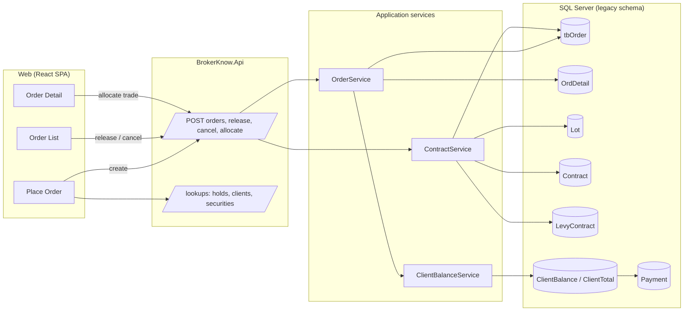
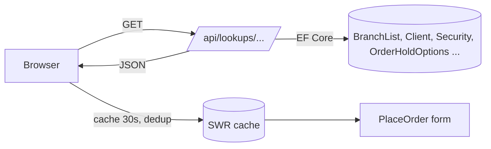
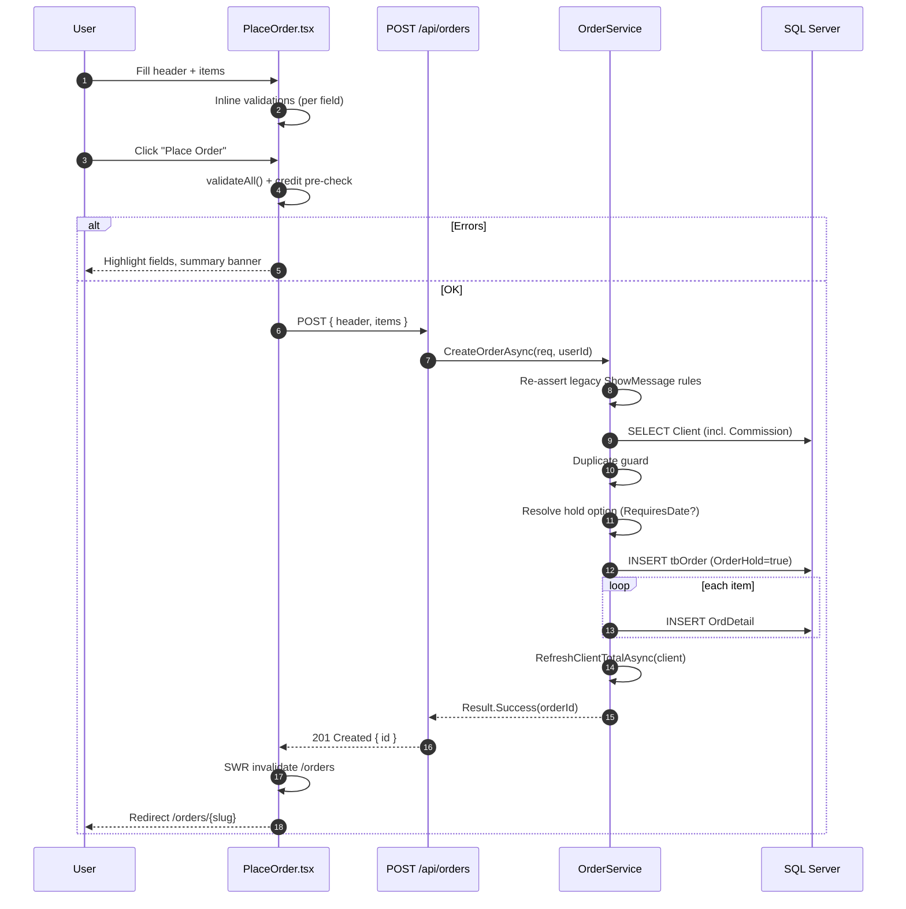
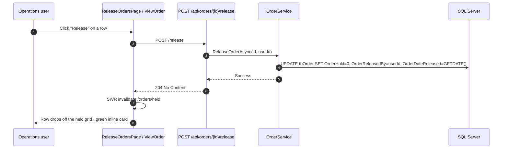
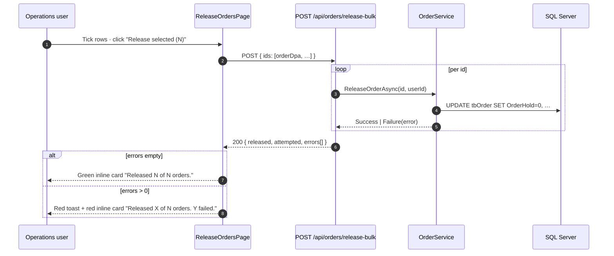
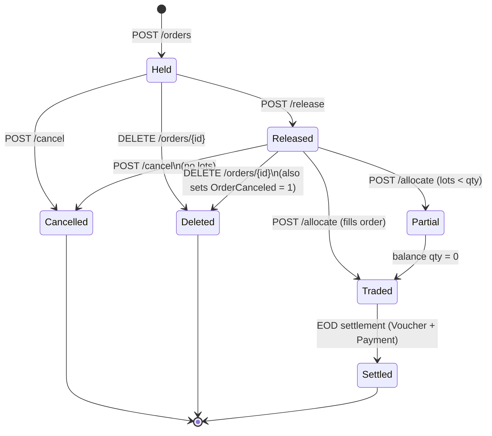
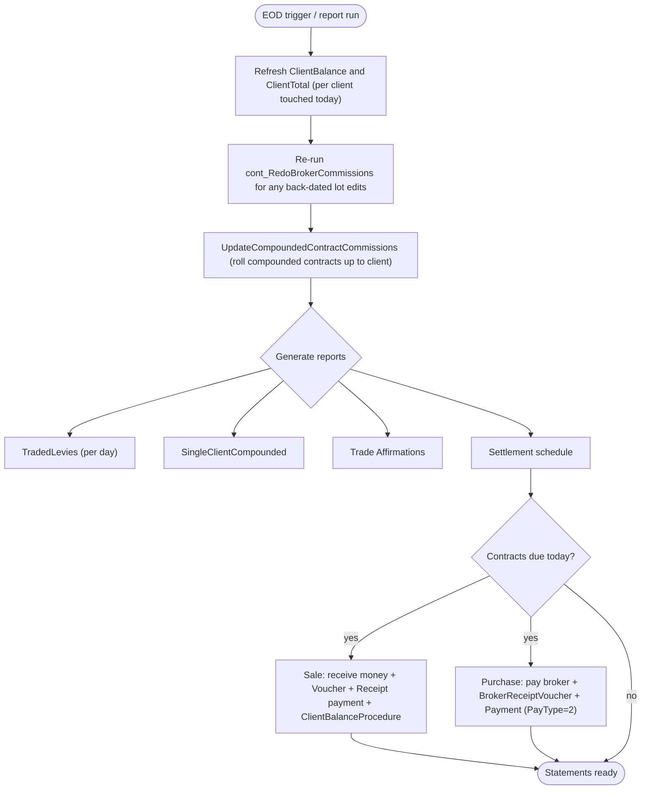
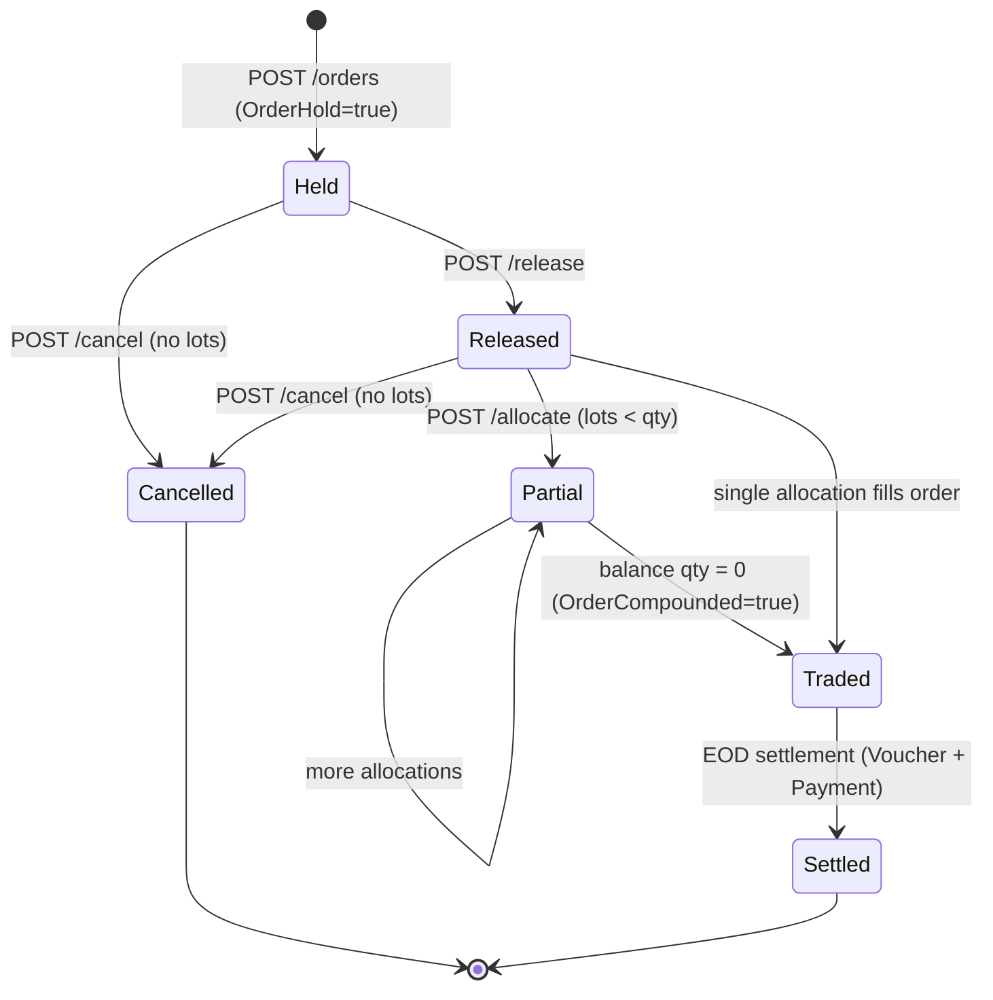
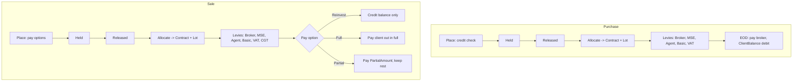

# Order Lifecycle — End-to-End

This document walks an order from **placement** through **release**, **trade matching**,
**contract creation** and **end-of-day settlement** — for both Purchase and Sale
sides. Each step lists the legacy artefact it derives from and the equivalent
modern API/UI module.

> All diagrams below are Mermaid; they render natively in GitHub, in VS Code
> (with the Markdown Preview Mermaid extension) and in Confluence's Mermaid macro.

---

## 0. End-to-end overview



---

## 1. Pre-flight: Reference Data

Before any order can be placed, the system depends on:

| Lookup | Legacy table | Modern lookup endpoint |
| --- | --- | --- |
| Branches | `BranchList` | `GET /api/lookups/branches` |
| Clients | `Client` (filtered by `Deleted = 0`) | `GET /api/lookups/clients?search=` |
| Order types (Purchase / Sale) | `OrderTypeList` | `GET /api/lookups/order-types` |
| Security types (Equity / Bond / …) | `OrderSecTypeList` | `GET /api/lookups/order-sec-types` |
| Securities | `Security` | `GET /api/lookups/securities` |
| Bonds | `Bond` | `GET /api/lookups/bonds` |
| Hold options | `OrderHoldOptions` | `GET /api/lookups/order-hold-options` |
| Agents | `Agent` | `GET /api/lookups/agents` |

`Hold options` drive how a new order is held (manual, until-given-date, etc.) and
include a `RequiresDate` flag the UI uses to conditionally show a "Held Date"
picker.



---

## 2. Placement (Add Order)

**Legacy:** `BK_Files/Files/AddOrder.asp`
**Modern:** `POST /api/orders` (handler: `OrderService.CreateOrderAsync`),
UI page `brokerknow-web/src/pages/Orders/PlaceOrder.tsx`.

### 2.1 Inputs collected

| Group | Field | Notes |
| --- | --- | --- |
| Header | Branch *, Client *, Order Date *, Order Type * (Purchase/Sale), Security Type *, Hold Option *, Held Date (if option requires it), Reference No (≤ 100), Remarks (≤ 50), CDA / Compound / Interbank flags | Required fields marked `*`. |
| Sale-only | Pay Option (`1`=Reinvest, `2`=Full, `3`=Partial), Partial Amount (when option `3`) | Hidden when Order Type = Purchase. |
| Item rows (1..n) | Security *, Bond (when sec type is fixed-income), Quantity, Price mode (`P` priced / `BF` best), Price (or BEST), Amount (Best+Purchase only), Certificate, Validity | UI mirrors legacy grid; multiple rows allowed per order. |

### 2.2 Validations applied (parity with legacy `ShowMessage` rules)

Performed both on the client (inline) and re-asserted on the server:

1. Branch is required.
2. Client is required and must exist.
3. Order Date cannot be in the past.
4. Order Type is required.
5. Security Type is required.
6. Hold Option is required; if its `RequiresDate = 1`, an `AutoReleaseDate` must
   be supplied.
7. Reference No ≤ 100 chars; Remarks ≤ 50 chars.
8. Each item row needs:
   - A Security.
   - For non-best (`P`) rows: positive Quantity and Price.
   - For best (`BF`) Purchase rows: Amount > 0.
   - Validity (if supplied) ≤ Order Date + 30 days.
9. **Pay options (Sale only):** if `PayOption = 3 (Partial)`, `PartialAmount` must
   be > 0.
10. **Credit check (Purchase only):** estimated value of all rows must not exceed
    `Available Credit = CurrentBalance + CreditLimit − OutstandingTotal`.
    "Best" rows estimate at `mktPrice × 1.020825` (legacy formula).

### 2.3 Persistence

Implemented in [`OrderService.CreateOrderAsync`](../../brokerknow-api/src/BrokerKnow.Application/Orders/OrderService.cs):

1. **Duplicate guard** — refuses if the same client already has an active,
   un-cancelled order for the same security on the same side and security type
   with unfilled lots.
2. Inserts a row into `tbOrder` with:
   - `OrderHold = true` (every new order starts on hold)
   - `OrderHoldType_DPA_ = OrderHoldOptionId`
   - `OrderAutoReleaseDate = AutoReleaseDate` (only when the option requires it)
   - `OrderCompounded = compounded`
   - `PayOption / PartialAmount` (only persisted on Sale orders)
   - `CreatedBy / TimeCreated / ChangedBy / TimeChanged = userId / now`
3. Inserts an `OrdDetail` row per item — qty, price, validity, cert no., bond,
   `Best` flag.
4. Calls `RefreshClientTotalAsync(ClientDpa)` so the client's outstanding total
   (sum of unfilled purchase orders + pending payment requests) is recalculated;
   this in turn affects available credit for any subsequent order.

### 2.4 Successful response

The API returns `201 Created` with `{ id }`; the SPA navigates to
`/orders/{slugged-id}` and lists/balances are auto-revalidated via SWR.

### 2.5 Sequence: place an order



---

## 3. Release (lifting the hold)

**Legacy:** `BK_Files/Files/ReleaseOrder.asp` (sets `OrderHold` and
`OrderHoldType_DPA_`).
**Modern:** `POST /api/orders/{id}/release` (handler:
`OrderService.ReleaseOrderAsync`), bulk `POST /api/orders/release-bulk`,
held-list `GET /api/orders/held`. Dedicated UI at `/operations/release-orders`
(file: `brokerknow-web/src/pages/Operations/ReleaseOrdersPage.tsx`).

A held order is invisible to the trading floor / matching engine. Releasing it:

1. Sets `OrderHold = false`.
2. Stamps `OrderReleasedBy = userId` and `OrderDateReleased = UtcNow`.
3. Updates `ChangedBy / TimeChanged`.

### 3.1 Where it's surfaced

| Surface | Single | Bulk | Notes |
| --- | --- | --- | --- |
| **Orders → Held tab** (`/orders?status=held`) | yes (row action) | no | Quick action while reviewing one order. |
| **Order Details** (`/orders/{id}`) | yes (header button) | no | After placing an order. |
| **Operations → Release Orders** (`/operations/release-orders`) | yes | yes | Dedicated triage page — flattened to one row per item so the symbol is visible. |
| **CDS Imports** *Release order →* link on `OrderHeld` rows | n/a | n/a | Deep-links to the page above with `?symbol=&client=&side=` pre-applied. |

### 3.2 Release Orders page

Mirrors the legacy *"Front Office → Release Orders"* grid but with one row per
`OrdDetail` so the operator can see the symbol/qty/price without expanding the
order. Features:

- **Filters** (Symbol / Client CDS / Side / free-text). All four are reflected
  in the URL query string so the page is shareable and the CDS-import deep-link
  arrives pre-filtered.
- **Bulk actions**: `Release selected (N)` and `Release all in view (N)`. Both
  call `POST /api/orders/release-bulk` with the list of `OrderDpa` values.
- **Per-row Release** button calls `POST /api/orders/{id}/release` directly.
- **Feedback** uses the same red-toast / colour-coded inline card pattern as
  the CDS imports page — partial bulk failures are reported with the count.

There is no direct "un-release" — to take an order back off the floor it must
be **cancelled**.

### 3.3 Sequence — single release



### 3.4 Sequence — bulk release



### 3.5 Why dedicated page (vs Orders → Held)

The Orders list shows **one row per order** (a single order can carry several
item rows for different securities), so it can't show the Symbol column —
which is exactly what the operator needs when responding to a CDS-import
`OrderHeld` reason ("release the held order for symbol X on client Y"). The
Release Orders page solves that by flattening to one row per `OrdDetail` and
keying the checkbox on `OrderDpa` (so two item rows in the same order share a
single checkbox effect — release flips the whole order, not individual items).

---

## 4. Cancellation

**Legacy:** `Operations/ReleaseOrder.asp` (cancel branch — `OrderCanceled = 1`).
**Modern:** `POST /api/orders/{id}/cancel` (handler:
`OrderService.CancelOrderAsync`).

Rules:

- A cancellation is **rejected** if the order has any non-deleted lots —
  contracts/lots have downstream financial effects (commissions, levies, broker
  voucher) so partially-filled orders are left alone and any unfilled balance is
  cancelled by reducing `OrdDetail` quantities through the trading workflow
  rather than by killing the order.
- Sets `OrderCanceled = true` (kept rather than physically deleted; `Deleted`
  bit remains 0 for audit). Audit columns updated.
- `RefreshClientTotalAsync` is called so the cancelled order frees up credit on
  the client.

---

## 4a. Edit (header)

**Legacy:** `Operations/EditOrderHeader.asp` (header) and
`Operations/EditOrderItem.asp` (items grid).
**Modern:** `PUT /api/orders/{id}` (handler:
`OrdersController.Update`), UI page
`brokerknow-web/src/pages/Orders/EditOrder.tsx`.

The legacy "Edit" UI lets Operations change a small set of header fields
even after the order has been compounded (traded). The items grid however
is hidden the moment `OrderCompounded = 1`, because contracts have already
been cut against the lines and changing qty/price/security would corrupt
downstream commissions and levies.

The modern endpoint mirrors that exactly:

| Field | Editable? |
| --- | --- |
| `OrderRef` | Yes (≤ 100 chars) |
| `Remarks` | Yes (≤ 50 chars) |
| `IsCustodian` | Yes |
| `InterBank` | Yes |
| `OrderCompounded` | Yes (operations override) |
| `OrderHold` | Yes — flipping back to held also clears `OrderReleasedBy` / `OrderDateReleased`, matching the legacy SP |
| `Items` (qty / price / security / cert / validity / bond) | **Read-only once `OrderCompounded = 1`**; the SPA replaces the grid with a notice |

**Server-side guard:** `Update` returns **400 Bad Request** if the order is
already `OrderCanceled = 1`. There is no item-level edit endpoint yet — for
held orders the user can still cancel and re-place; for traded orders the
items are immutable by design.

---

## 4b. Delete (soft)

**Legacy:** `Operations/DeleteOrder.asp`.
**Modern:** `DELETE /api/orders/{id}` (handler:
`OrdersController.Delete`).

Both implementations are **soft deletes** that set `tbOrder.Deleted = 1` (and
`OrdDetail.Deleted = 1` for every row).

Delete differs from Cancel in three ways:

| | Cancel | Delete |
| --- | --- | --- |
| What it sets | `OrderCanceled = 1` | `Deleted = 1` (+ `OrderCanceled = 1` if not held) |
| Stays visible? | Yes — appears under the **Canceled** tab | No — hidden from every list (filtered out by EF query filter) |
| Allowed when traded? | No (lots exist) | No (lots exist) |
| Used when | Client phones to abandon a placed order | Operations needs to scrub a typo / mistaken entry from history |

The modern Delete also reproduces the legacy behaviour where a released
(non-held) order is both `OrderCanceled = 1` AND `Deleted = 1`, so it
disappears from all views.

**Server-side guards:**
- 400 if any non-deleted `Lot` references this order's `OrdDetail` rows
  (matches the legacy `_Parent_Child_Links_` check). Hint message tells the
  user to use Cancel instead.

---

## 4c. Action visibility matrix (UI)

`OrderList.tsx` and `ViewOrder.tsx` use `RowActions` with `show` rules so the
user only sees buttons that are valid for the current order state. Mirrors the
legacy ASP's per-status button toggling.

| State | View | Edit | Release | Cancel | Delete | + Allocate |
| --- | :---: | :---: | :---: | :---: | :---: | :---: |
| Held (`OrderHold`) | ✓ | ✓ | ✓ | ✓ | ✓ | — |
| Released (`!OrderHold`) | ✓ | ✓ | — | ✓ | ✓ | ✓ (per item, balance > 0) |
| Partial (some lots) | ✓ | ✓ | — | — *(blocked at API: lots exist)* | — | ✓ (remaining balance) |
| Traded (`OrderCompounded`) | ✓ | ✓ | — | — | — | — |
| Cancelled (`OrderCanceled`) | ✓ | — | — | — | — | — |

State diagram, legend, and underlying boolean flags are in §8.



---

## 5. Trade Matching (Lot allocation)

**Legacy:** lots are inserted manually via `Lot.asp` family (post-trade entry
done by Operations after the broker confirms slips).
**Modern:** `POST /api/orders/allocate` calling
`ContractService.CreateContractAsync`, which **also creates the contract** in a
single transaction (this combines the legacy two-step "add lot, then run
`cont_CreateContract`" workflow).

A trade match takes:

| Field | Notes |
| --- | --- |
| `OrdDetailDpa` | Which order line is being filled. |
| `BrokerDpa` | Counterparty broker on the floor. |
| `Quantity`, `Price` | Filled volume + price for this slip. |
| `SlipNo` | Broker-provided slip identifier (≤ 20). |
| `TradeDate` | The exchange trade date. |
| `SettlementDate` | Per-instrument T+n date (e.g. T+3 equities). |

What `ContractService.CreateContractAsync` does, mirroring
`dbo.cont_CreateContract`:

1. Loads the `OrdDetail` (with order, client, agent, commission profile).
2. Computes `LotGrossAmount = round(Quantity × Price, 2)` and the `Side`
   marker (`P`/`S`) from the order type description's first letter.
3. **Creates the `Contract` row** (legacy `INSERT INTO Contract …`) with the
   settlement date.
4. **Inserts the `Lot` row** linking back to the contract and `OrdDetail`.
5. Inserts placeholder `LevyContract` rows for every levy that always applies:
   - `SystemMaintained = 11` Broker Commission
   - `SystemMaintained = 25` MSE Commission
   - `SystemMaintained = 12` Agent Commission
   - `SystemMaintained = 100` Handling/Basic Fee
   - `SystemMaintained = 99` VAT
   - `SystemMaintained = 101` CGT — **Sale side only** (post-2026 patch)
6. Calls `RecalculateBrokerCommissions` (legacy `cont_RedoBrokerCommissions`):
   - Sums every lot for the same `OrdDetail` on the same `TradeDate`.
   - Picks the right tier from the client's commission profile (3-tier band:
     `Rate / Median / Upper` against `LowerBound / UpperBound`, with
     `MinimumCommission` floor).
   - Distributes the band commission **proportionally to each lot's gross**.
   - Recalculates MSE, Agent, Basic, VAT (Broker+Basic) for each lot.
7. Sets `tbOrder.OrderCompounded = true` so the order is marked as
   filled/processed.

Net effect: a single API call yields a Contract + Lot + LevyContracts, ready
for affirmation/settlement.

### 5.1 Sequence: allocate a trade

```mermaid
sequenceDiagram
    autonumber
    participant U as Operations
    participant W as ViewOrder.tsx
    participant A as POST /api/orders/allocate
    participant C as ContractService
    participant DB as SQL Server

    U->>W: Enter slip (qty, price, broker, dates)
    W->>A: POST { OrdDetailDpa, BrokerDpa, qty, price, slipNo, tradeDate, settle }
    A->>C: CreateContractAsync(req, userId)
    C->>DB: SELECT OrdDetail + Order + Client + Commission + Agent
    C->>C: lotGross = qty * price; side = first letter of OrderType.Description
    C->>DB: INSERT Contract (settlement)
    C->>DB: INSERT Lot (qty, price, slip, contractNumber)
    Note over C,DB: Insert placeholder LevyContract rows: SM 11 Broker, 25 MSE, 12 Agent, 100 Basic, 99 VAT, 101 CGT (Sale only)
    C->>C: RecalculateBrokerCommissions() (banded, distribute by lot gross)
    C->>DB: UPDATE LevyContract amounts
    C->>DB: UPDATE tbOrder SET OrderCompounded=1
    C-->>A: Result.Success(contractId)
    A-->>W: 200 OK { contractId }
    W->>W: SWR refresh /orders/{id}
    W-->>U: Lots & contract appear in detail
```

---

## 6. Confirmations & Affirmation

**Legacy:** `TradeAffirmation` view feeds the affirmation report
(`TradeAffirmation.asp`) which is faxed/emailed to the client.
**Modern:** the contract data is already on the order detail page
(`/orders/:id`) under "Allocated Lots" — a printable affirmation report can be
generated from the same query (work item: separate report endpoint).

---

## 7. End-of-Day Process

These steps are run once per trade date (or on demand for a date range).

### 7.1 Refresh balances

| Procedure | What it computes | API equivalent |
| --- | --- | --- |
| `dbo.ClientBalanceProcedure` | Sum of all journal/payment entries → `ClientBalance` | `ClientBalanceService.RefreshClientBalanceAsync(clientId)` (called by `PaymentService` after every receipt/payment) |
| `dbo.ClientTotalProcedure` | Sum of unfilled purchase order value + pending payment requests → `ClientTotal` | `OrderService.RefreshClientTotalAsync(clientId)` (called after order create/cancel) |

### 7.2 Levy compounding (per contract)

Once all of the day's contracts exist:

- `cont_RedoBrokerCommissions` is re-run for any back-dated edits to lots/prices.
- `UpdateCompoundedContractCommissions` (`sp_UpdateCompoundedContractCommissions.sql`)
  rolls compounded contracts (`OrderCompounded = 1`) up to the parent client and
  flushes the per-contract commission view.
- `ContractLeviesCrossTab` view is the pivot fed by `TradedLevies.asp` for the
  day's broker commission/levies report.

### 7.3 Reports generated

| Report | View / Source | Used by |
| --- | --- | --- |
| Traded Levies (per day) | `ContractLeviesCrossTab` | `TradedLevies.asp` |
| Single client compounded contract | `ContractCompoundedClients` | `SingleClientCompounded.asp` |
| Trade affirmations | `TradeAffirmation` view | `TradeAffirmation.asp` |
| Settlement schedule | `Lot` joined with `Contract.ContractSettlementDate` | Future modern report |

### 7.4 Settlement

For each `Contract` whose `ContractSettlementDate <= today`:

1. **Sale side** — money is **received** from the buyer's broker; a `Voucher`
   row links the contract to the inbound payment, then a `Payment`
   (`PayType_DPA_ = 1` Receipt, `EntityType_DPA_ = 1` Client) is posted to the
   client's account, `ClientBalanceProcedure` re-runs, and the contract's
   `Voucher_DPA_` is stamped.
2. **Purchase side** — money is **paid out** to the seller's broker; a
   `BrokerReceiptVoucher` row is created and a `Payment`
   (`PayType_DPA_ = 2` Payment, `EntityType_DPA_ = 3` Broker) is posted; on
   the client side the previously-held credit is consumed.
3. The `ClientStatement` view (and equivalent SPA "client transactions" tab)
   lists the resulting debits/credits for client reconciliation.

### 7.5 End-of-day flow



---

## 8. State diagram (per order)



The Orders list and detail page surface this state through the `OrderStatusBadge`
component:

- **Held** — `OrderHold && !OrderCanceled`
- **Released** — `!OrderHold && !OrderCanceled && !OrderCompounded`
- **Traded** — `OrderCompounded`
- **Cancelled** — `OrderCanceled`

---

## 9. Side-by-side: Purchase vs Sale

| Step | Purchase | Sale |
| --- | --- | --- |
| Place | Credit check enforced; "Best+BF" requires Amount > 0; Pay options hidden | No credit check; Pay options visible (Reinvest / Full / Partial) |
| Hold | Identical | Identical |
| Release | Identical | Identical |
| Match | Same `ContractService.CreateContractAsync` flow | Same flow + CGT levy (`SystemMaintained = 101`) added |
| EOD | `ClientBalance` debit (cash leaves the client) | `ClientBalance` credit + Pay-Option determines whether balance is reinvested, fully paid out, or partially paid out |

### 9.1 Swimlane: Purchase vs Sale



---

## 10. Where to look in the code

| Concern | File |
| --- | --- |
| Place order page (UI) | `brokerknow-web/src/pages/Orders/PlaceOrder.tsx` |
| Order list / actions | `brokerknow-web/src/pages/Orders/OrderList.tsx` |
| Order detail | `brokerknow-web/src/pages/Orders/ViewOrder.tsx` |
| Mutations + cache invalidation | `brokerknow-web/src/data/hooks.ts` (`createOrder`, `releaseOrder`, `cancelOrder`, `allocateTrade`) |
| Server-side lifecycle | `brokerknow-api/src/BrokerKnow.Application/Orders/OrderService.cs` |
| Trade match → Contract | `brokerknow-api/src/BrokerKnow.Application/Contracts/ContractService.cs` |
| Lookups (hold options, clients, bonds, …) | `brokerknow-api/src/BrokerKnow.Api/Controllers/LookupsController.cs` |
| Domain model | `brokerknow-api/src/BrokerKnow.Domain/Entities/Order.cs` (+ `OrderDetail`, `Lot`, `Contract`, `LevyContract`, `OrderHoldOption`) |
| Legacy reference | `BK_Files/Files/AddOrder.asp`, `ReleaseOrder.asp`, `TradedLevies.asp`, `SingleClientCompounded.asp`; `BK_Files/Legacy_System/sp_cont_CreateContract.sql`, `sp_cont_RedoBrokerCommissions.sql`, `sp_ClientBalanceProcedure.sql`, `sp_ClientTotalProcedure.sql` |
