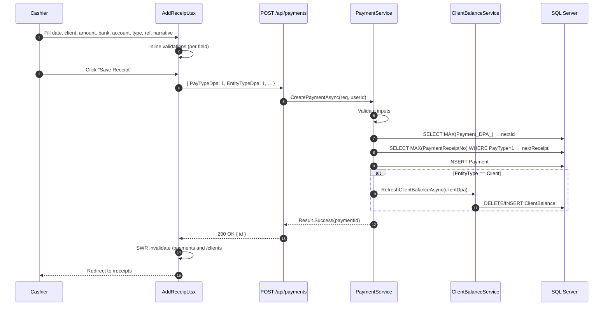
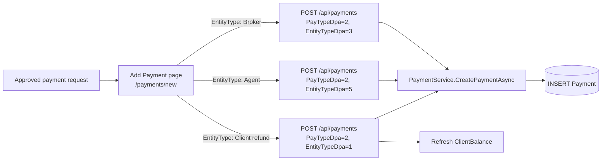
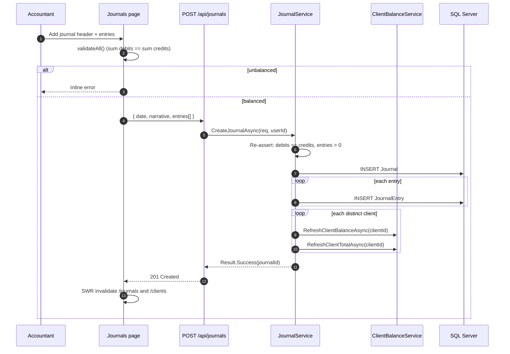
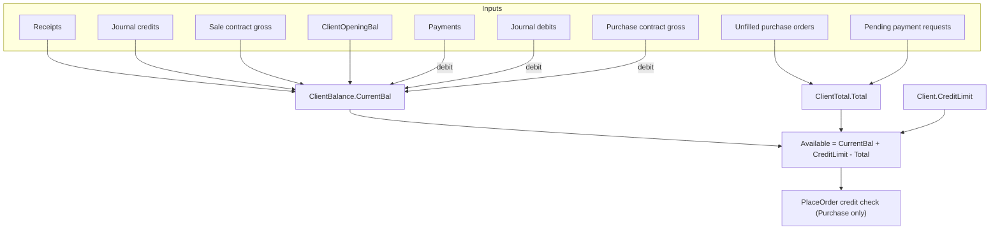
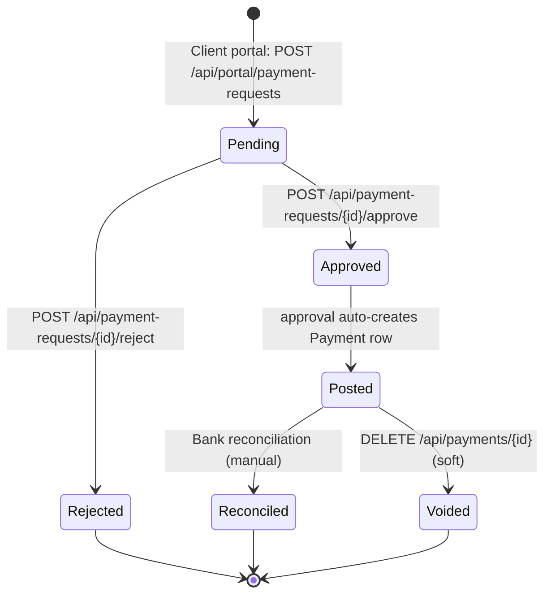
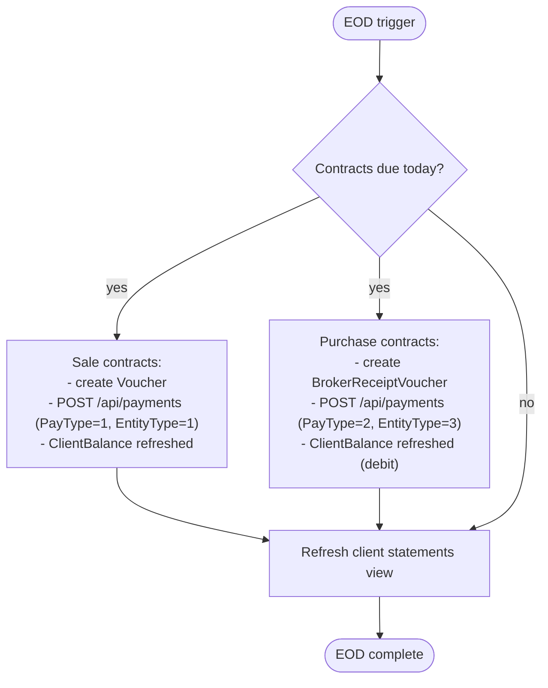
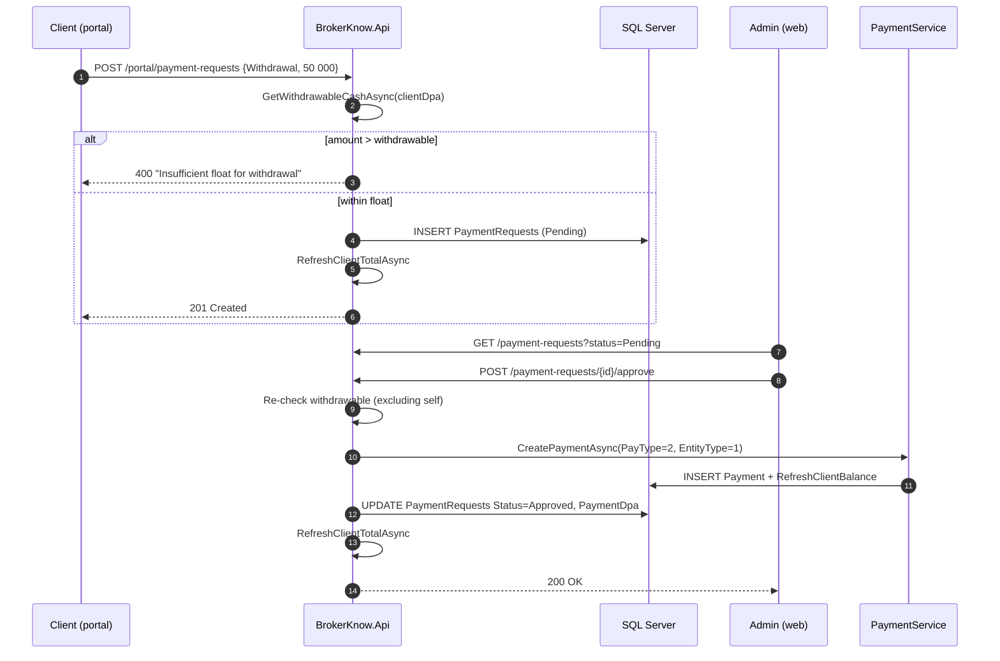

# Payments, Receipts & Journals — End-to-End

This document covers the **money side** of BrokerKnow: cash receipts and payouts to
clients/brokers/agents, double-entry journals, and how they interact with the
materialised `ClientBalance` and `ClientTotal` tables that drive available
credit and statements.

> All diagrams are Mermaid; they render natively in GitHub, in VS Code (with the
> Markdown Preview Mermaid extension) and in Confluence's Mermaid macro.

---

## 0. Overview

```mermaid
flowchart LR
    subgraph UI["Web (React SPA)"]
        UI_Pay[Payments / Receipts]
        UI_Jrn[Journals]
        UI_Stmt[Client statement]
    end
    subgraph API["BrokerKnow.Api"]
        API_Pay[/POST /api/payments/]
        API_Jrn[/POST /api/journals/]
        API_Bal[/GET /api/clients/{id}/balance/]
    end
    subgraph SVC["Application services"]
        PaySvc[PaymentService]
        JrnSvc[JournalService]
        BalSvc[ClientBalanceService]
    end
    subgraph DB["SQL Server (legacy schema)"]
        PMT[(Payment)]
        JRN[(Journal / JournalEntry)]
        BAL[(ClientBalance)]
        TOT[(ClientTotal)]
        CON[(Contract / Lot)]
    end

    UI_Pay --> API_Pay
    UI_Jrn --> API_Jrn
    UI_Stmt --> API_Bal

    API_Pay --> PaySvc
    API_Jrn --> JrnSvc
    PaySvc --> PMT
    PaySvc --> BalSvc
    JrnSvc --> JRN
    JrnSvc --> BalSvc
    BalSvc --> BAL
    BalSvc --> TOT
    CON -. cost / proceeds .-> BalSvc
```

---

## 1. Payment domain model

Two enumerated dimensions appear in nearly every payment/balance query:

| `PayType_DPA_` | Meaning | UI label |
| --- | --- | --- |
| 1 | Receipt (money received) | Receipt |
| 2 | Payment (money paid out)  | Payment |

| `EntityType_DPA_` | Counterparty | Notes |
| --- | --- | --- |
| 1 | Client | Affects client balance/credit |
| 3 | Broker | Used for broker payouts on Purchase settlement |
| 5 | Agent  | Agent commission disbursements |
| 6 | Levy   | Pass-through accounts (e.g. CGT, MSE) |

`Entity_DPA_` is a polymorphic FK that points at the row in the relevant table
(`Client`, `Broker`, `Agent`, `Entity`).

---

## 2. Receipt — money in (Receipt to a Client)

**Legacy:** `Operations/AddReceipt.asp`, `Operations/EditReceipt.asp`,
`Operations/DeleteReceipt.asp`.
**Modern:** CRUD via `POST/PUT/DELETE /api/payments`, handler
`PaymentService`. UI pages: `/receipts` (list), `/receipts/new` (add),
`/receipts/:id/edit` (edit).

### 2.1 Inputs (Add & Edit)

| Field | Notes |
| --- | --- |
| Date * | Must be a valid date, normally today |
| Client * | Searchable `SearchableSelect` (`/lookups/clients`) |
| Amount (MWK) * | > 0, numeric |
| Payment Type * | Cash / Cheque / Transfer etc. (`/lookups/payment-types`). When the selected type has `Reference = 1` in the DB, the reference field becomes required (server-enforced) |
| Bank * | Receiving bank (`/lookups/banks`). Drives the bank-account filter |
| Bank Account * | Account within the selected bank (`/lookups/bank-accounts?bankId=`) |
| Reference | External / cheque reference, ≤ 20 chars |
| Narrative | Note for the client statement, ≤ 200 chars |

All validations mirror the legacy `ShowMessage` rules in `AddReceipt.asp`.

### 2.2 Add Receipt (Create)

`POST /api/payments` with `PayTypeDpa = 1`, `EntityTypeDpa = 1`.

`PaymentService.CreatePaymentAsync`:

1. Validates all inputs (amount > 0, reference ≤ 20, narrative ≤ 200, etc.).
2. Generates `Payment_DPA_ = MAX(Payment_DPA_) + 1` (legacy pattern, not IDENTITY).
3. **Auto-numbers the receipt** (`PaymentReceiptNo = MAX + 1` over `PayType=1`).
4. Inserts the `Payment` row.
5. If the entity is a client (`EntityType=1`) calls
   `ClientBalanceService.RefreshClientBalanceAsync(clientId)` so the materialised
   `ClientBalance.CurrentBal` is updated immediately.



### 2.3 Edit Receipt

`PUT /api/payments/{id}`.

**Legacy:** `Operations/EditReceipt.asp` — always accessible from the list (no
UI guard prevents opening). On save, the server manages
`BrokerReceiptVoucher_DPA_` unlinking if the receipt had been linked to a
contract settlement.

**Modern behaviour:**

| Aspect | Detail |
| --- | --- |
| Guard (server) | Returns **400** if `VoucherDpa` is set — "This payment has been linked to a contract voucher and can no longer be edited." |
| Guard (UI) | Edit button on the receipts list is **greyed out** when `voucherDpa != null` so the user can't click it |
| Fields | Same as Add, pre-populated from the existing payment |
| Balance refresh | If the entity is a client, `RefreshClientBalanceAsync` is called after saving |

### 2.4 Delete Receipt

`DELETE /api/payments/{id}`.

**Legacy:** `Operations/DeleteReceipt.asp` — always accessible from the list.
Uses `_Parent_Child_Links_` metadata to check for dependent child records.
If a `BrokerReceiptVoucher` is linked, the legacy code unlinks the contract
and physically deletes both the voucher and the payment row.

**Modern behaviour:**

| Aspect | Detail |
| --- | --- |
| Type | **Soft delete** (`Deleted = 1`), not physical delete |
| Guard (server) | Returns **400** if `VoucherDpa` is set — "This payment has been linked to a contract voucher and can no longer be deleted." |
| Guard (UI) | Delete button on the receipts list is **greyed out** when `voucherDpa != null` |
| Balance refresh | If the entity is a client, `RefreshClientBalanceAsync` is called after deleting |

### 2.5 Action visibility matrix (Receipts & Payments list)

| State | Edit | Delete |
| :--- | :---: | :---: |
| Normal receipt / payment (no voucher) | ✓ | ✓ |
| Voucher-linked (contract settlement posted) | disabled (greyed out) | disabled (greyed out) |

The list endpoint returns `voucherDpa` per row so the SPA can derive the
button state without an extra API call.

### 2.6 Cancel vs Delete (Receipts)

There is **no separate Cancel action** for receipts (unlike orders). The only
way to remove a receipt is to Delete it (soft delete). If the receipt has
already been used in a contract settlement (voucher-linked), neither editing
nor deleting is permitted — the user must reverse the settlement first
(out of scope for now; tracked as a future admin action).

---

## 3. Payment — money out (Payment to a Broker / Agent / Client)

**Legacy:** `Operations/AddPayment.asp`.
**Modern:** UI page `brokerknow-web/src/pages/Payments/AddPayment.tsx` (route `/payments/new`); same endpoint as receipts with `PayTypeDpa = 2`.

The same flow as a receipt, with three differences:

- **No auto-numbering** of receipt no (kept blank for payments).
- The polymorphic entity is usually a **Broker** (purchase settlement) or **Agent** (commission disbursement) — but client refunds are also supported by setting `EntityTypeDpa = 1`.
- For client refunds the balance refresh decreases `CurrentBal`; for broker/agent payouts no client balance is affected.

The Add Payment form mirrors Add Receipt: amount > 0, reference ≤ 20, narrative ≤ 200, plus an **Entity Type** selector (Client refund / Broker / Agent) which drives the entity dropdown. Edit and Delete follow the same rules as receipts (§2.3 and §2.4) — including the voucher-link guard on both server and UI.



---

## 4. Journals — manual double-entry

**Legacy:** `Operations/AddJournal.asp` (with the `JournalEntry` grid).
**Modern:** `POST /api/journals`, handler `JournalService.CreateJournalAsync`.

Used for adjustments that aren't a cash movement: write-offs, opening
balances, manual fee corrections, etc.

### 4.1 Inputs

A journal header (date + narrative) plus N entries, each with:

- `EntityTypeDpa`, `EntityDpa` (which account the entry hits)
- `Debit`, `Credit` (one of the two is non-zero)
- Optional per-entry narrative

### 4.2 Validations

1. **Must be balanced** — `SUM(Debit) === SUM(Credit)`. Returned as
   `Journal not balanced. Debits: x, Credits: y`.
2. At least one entry.

### 4.3 Persistence + side effects

`JournalService.CreateJournalAsync`:

1. Insert `Journal` row, save.
2. Insert each `JournalEntry`, save.
3. For every distinct **client** entity referenced
   (`EntityTypeDpa = 1`) call `RefreshClientBalanceAsync` and
   `RefreshClientTotalAsync` — so the journal's effect is reflected in the
   client's available credit immediately.



A `ReleaseJournalAsync` endpoint exists for the legacy "post" step
(currently it just stamps audit columns; expand it when GL posting/locking is
introduced).

---

## 5. Materialised balances (ClientBalance / ClientTotal)

These two tables exist for performance — they answer "available credit" without
re-summing the full ledger every time a screen loads. They are kept in sync by
`ClientBalanceService`.

### 5.1 `ClientBalance.CurrentBal`

Replicates `dbo.ClientBalanceProcedure`:

```
CurrentBal = ClientOpeningBal
           + (Receipts to client)        -- Payment.PayType=1, EntityType=1
           + (Journal credits to client)
           + (Sale contract proceeds)    -- gross from Lot for client's sale contracts
           - (Payments from client)       -- Payment.PayType=2, EntityType=1
           - (Journal debits to client)
           - (Purchase contract costs)    -- gross from Lot for client's purchase contracts
```

Recalculated:

- Whenever a `Payment` is saved against a client.
- For every distinct client touched by a journal.
- (Optionally) end-of-day for back-dated contract edits.

### 5.2 `ClientTotal.Total`

Replicates `dbo.ClientTotalProcedure`:

```
Total = SUM(unfilled purchase order value)
      + SUM(pending payment requests)
```

Where unfilled purchase order value uses `(qty - filledQty) * price`, and Best
orders estimate at `mktPrice * 1.020825` (legacy formula).

Recalculated whenever an order is created, cancelled, allocated, or whenever a
journal touches a client account.

### 5.3 Available credit

```
Available = CurrentBal + CreditLimit - Total
```

Surfaced through `GET /api/clients/{id}/balance` and used by `PlaceOrder.tsx`
for the pre-flight credit check on Purchase orders.



---

## 6. State / status diagram per Payment



The full workflow is now implemented end-to-end. See §10 for the Payment
Requests detail.

---

## 7. End-of-day interactions



---

## 8. Side-by-side: Receipt vs Payment

| Aspect | Receipt (PayType=1) | Payment (PayType=2) |
| --- | --- | --- |
| Direction | money in | money out |
| Auto-numbered | yes (`PaymentReceiptNo`) | no |
| Typical entity | Client | Broker, Agent, Client (refund) |
| Affects ClientBalance | + when EntityType=1 | − when EntityType=1; no effect for Broker/Agent |
| Common trigger | client deposit | settlement payout, commission disbursement |
| UI tab | "Receipts" | "Payments" (default) |

---

## 9. Where to look in the code

| Concern | File |
| --- | --- |
| Receipts list | `brokerknow-web/src/pages/Payments/PaymentsList.tsx` (route `/receipts`) |
| Add receipt page | `brokerknow-web/src/pages/Payments/AddReceipt.tsx` (route `/receipts/new`) |
| Edit receipt page | `brokerknow-web/src/pages/Payments/AddReceipt.tsx` → `EditReceipt` export (route `/receipts/:id/edit`) |
| Payments list | `brokerknow-web/src/pages/Payments/PaymentsList.tsx` (route `/payments`) |
| Add payment page | `brokerknow-web/src/pages/Payments/AddPayment.tsx` (route `/payments/new`) |
| Payment requests (admin) | `brokerknow-web/src/pages/Payments/PaymentRequestsPage.tsx` (route `/accounts/payment-requests`) |
| Payment requests (portal) | `brokerknow-portal/src/pages/RequestPaymentPage.tsx` (route `/request-payment`) |
| Mutations + cache invalidation | `brokerknow-web/src/data/hooks.ts` (`createPayment`, `updatePayment`, `deletePayment`, `usePayment`, `usePaymentRequests`, `approvePaymentRequest`, `rejectPaymentRequest`) |
| Receipt/Payment service (all CRUD) | `brokerknow-api/src/BrokerKnow.Application/Payments/PaymentService.cs` |
| Payments controller (endpoints) | `brokerknow-api/src/BrokerKnow.Api/Controllers/PaymentsController.cs` |
| Payment requests controller (admin) | `brokerknow-api/src/BrokerKnow.Api/Controllers/PaymentRequestsController.cs` |
| Portal endpoints (balance, payment requests) | `brokerknow-api/src/BrokerKnow.Api/Controllers/PortalController.cs` |
| Lookup endpoints (banks, bank-accounts, payment-types) | `brokerknow-api/src/BrokerKnow.Api/Controllers/LookupsController.cs` |
| Balance/total recalculation + withdrawable cash | `brokerknow-api/src/BrokerKnow.Application/Payments/ClientBalanceService.cs` (`RefreshClientBalanceAsync`, `RefreshClientTotalAsync`, `GetWithdrawableCashAsync`) |
| Journals service | `brokerknow-api/src/BrokerKnow.Application/Journals/JournalService.cs` |
| Client statement endpoint | `brokerknow-api/src/BrokerKnow.Api/Controllers/ClientsController.cs` → `GetStatement`, `GetStatementCsv`, `GetStatementPdf` |
| Client statement PDF (QuestPDF) | `brokerknow-api/src/BrokerKnow.Reports/Statements/ClientStatementPdf.cs` |
| Client statement page | `brokerknow-web/src/pages/Clients/ClientStatement.tsx` |
| Spinner / loading indicators | `brokerknow-web/src/components/common/Spinner.tsx` |
| Domain model | `brokerknow-api/src/BrokerKnow.Domain/Entities/Payment.cs`, `PaymentRequest.cs`, `Journal.cs`, `JournalEntry.cs`, `ClientBalance.cs`, `ClientTotal.cs`, `Bank.cs`, `BankAccount.cs`, `PaymentType.cs` |
| EF configuration (PaymentRequests) | `brokerknow-api/src/BrokerKnow.Infrastructure/Persistence/Configurations/PaymentRequestConfiguration.cs` |
| Startup DDL (idempotent) | `brokerknow-api/src/BrokerKnow.Api/Program.cs` (`CREATE TABLE dbo.PaymentRequests`) |
| Legacy reference | `BK_Files/Legacy_System/Brokerknow_Malawi/19 Brokerknow Malawi/Operations/AddReceipt.asp`, `EditReceipt.asp`, `DeleteReceipt.asp`, `ReceiptList.asp`, `AddPayment.asp`; `sp_ClientBalanceProcedure.sql`, `sp_ClientTotalProcedure.sql`, `view_ClientStatement.sql` |

---

## 10. Payment Requests (client-initiated deposits & withdrawals)

**Why:** clients self-serve top-ups and cash-outs from the portal; back-office
staff approve/reject. This replaces the legacy practice of phoning the
cashier and avoids forcing the cashier to capture both sides.

**Storage:** `dbo.PortalPaymentRequests` (modern table, `Id IDENTITY`). Created
idempotently from `Program.cs` startup DDL. Named with the `Portal` prefix
because the legacy schema already has a `dbo.PaymentRequests` table with a
completely different shape (`Request_DPA_`, `Approved smallint`, multi-stage
approval columns, etc.) that is not used by the modern stack.

| Column | Notes |
| --- | --- |
| `Id` | IDENTITY PK (modern table — no MAX+1) |
| `ClientDpa` | The requesting client |
| `RequestType` | `Deposit` or `Withdrawal` |
| `Amount` | `decimal(18,2)`, > 0 |
| `Reference` | nvarchar(50), optional |
| `Narrative` | nvarchar(500), optional |
| `Status` | `Pending` / `Approved` / `Rejected` (default `Pending`) |
| `RejectReason` | populated on reject |
| `PortalUserId`, `CreatedAt`, `CreatedBy`, `ProcessedBy`, `ProcessedAt` | audit |
| `PaymentDpa` | populated on Approve — links to the created `Payment.Payment_DPA_` |

### 10.1 Client — submit a request (portal)

- Page: `brokerknow-portal/src/pages/RequestPaymentPage.tsx` (route
  `/request-payment`, sidebar **Request Payment**).
- Lists own past requests with status badges + rejection reasons.
- Three balance cards: Available balance, **Withdrawable now**, Credit limit.
- Endpoint: `POST /api/portal/payment-requests`
  `{ requestType, amount, reference?, narrative? }`.
- After submit, refreshes both the request list and `/api/portal/balance`.

### 10.2 Withdrawable cash & balance check

To prevent under-funded withdrawal requests we expose a server-side
**withdrawable cash** figure separate from the trading-credit Available
balance:

$$\text{withdrawable} = \max\bigl(0,\ \text{ClientBalance.CurrentBal} - \sum \text{pending withdrawal requests}\bigr)$$

- `Client.CreditLimit` is **deliberately excluded** — it's a trading facility,
  not cashable float.
- Pending withdrawals are subtracted so a client cannot queue multiple
  requests totalling more than their cash.
- Implemented as `ClientBalanceService.GetWithdrawableCashAsync(clientDpa)`.
- Returned on `GET /api/portal/balance` as the `withdrawable` field alongside
  `currentBal`, `creditLimit`, `available`.

**Two enforcement points** (the UI guard is convenience only):

| Layer | Behaviour |
| --- | --- |
| Portal `POST /api/portal/payment-requests` | If `requestType == Withdrawal` and `amount > withdrawable`, returns **400** before inserting the row. |
| Admin `POST /api/payment-requests/{id}/approve` | Re-checks at approval time (balance can drift). Adds the request's own amount back so it does not double-count itself, then rejects with **400** if still over. |

The portal UI mirrors this: red helper text under the amount input, and the
Submit button is disabled when the amount exceeds withdrawable or when
withdrawable ≤ 0.

### 10.3 Admin — approve / reject

- Page: `brokerknow-web/src/pages/Payments/PaymentRequestsPage.tsx` (route
  `/accounts/payment-requests`, sidebar **Accounts → Payment Requests**).
- Tabs: Pending / Approved / Rejected / All; Pending count badge on tab.
- Endpoints: `GET /api/payment-requests?status=&clientDpa=&take=`,
  `POST /api/payment-requests/{id}/approve`,
  `POST /api/payment-requests/{id}/reject` (`{ reason }`).

**Approve flow:**

1. Server re-runs the withdrawable cash check (Withdrawals only).
2. Maps request → Payment: `Withdrawal → PayType=2`, `Deposit → PayType=1`,
   `EntityType=1`, `EntityDpa = ClientDpa`.
3. Calls `PaymentService.CreatePaymentAsync` — same path as a manual cashier
   entry, so receipt auto-numbering, balance refresh, and audit columns all
   apply.
4. Stamps the request: `Status='Approved'`, `PaymentDpa = newId`,
   `ProcessedBy`, `ProcessedAt`.
5. Calls `RefreshClientTotalAsync` so the now-approved Withdrawal is no
   longer counted as pending in §5.2.

**Reject flow:** stamps `Status='Rejected' + RejectReason`, then
`RefreshClientTotalAsync` (so a rejected Withdrawal stops weighing on the
total).



### 10.4 Why this lives in `ClientTotal`

Per §5.2, `ClientTotal.Total` (and therefore Available balance) includes
`SUM(Amount) WHERE Status='Pending' AND RequestType='Withdrawal'`. This
matches the legacy `sp_ClientTotalProcedure` and means a pending withdrawal
immediately reduces the client's tradeable Available — they cannot place a
purchase order against funds that are about to leave.
