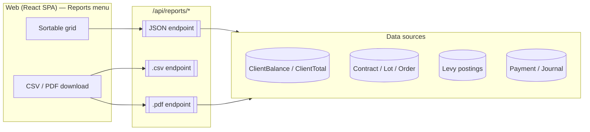

# Reports — Inventory & Reference

This document is the catalogue of BrokerKnow's back-office **reports**: what each
one is for, its API endpoint(s), the key filters it accepts, and where the data
comes from. It complements the money-side detail in
[`Payments_And_Journals.md`](Payments_And_Journals.md) and the trade-side detail
in [`Order_Lifecycle.md`](Order_Lifecycle.md) / [`CDS_Trade_Imports.md`](CDS_Trade_Imports.md).

All reports are served by
[`ReportsController`](../../brokerknow-api/src/BrokerKnow.Api/Controllers/ReportsController.cs)
and the PDFs are rendered (QuestPDF) under
[`BrokerKnow.Reports`](../../brokerknow-api/src/BrokerKnow.Reports/).

> Diagrams below are Mermaid; they render natively in GitHub, in VS Code (with the
> Markdown Preview Mermaid extension) and in Confluence's Mermaid macro.

---

## 0. Overview

- **Base route:** every endpoint lives under `/api/reports/…`.
- **Authorization:** the controller is `[RequireArea(Reports)]` + `[RequirePage("reports")]`,
  so a user needs the **Reports** page to reach any of them.
- **Three siblings per report:** the bare route returns **JSON** (the on-screen,
  sortable grid); a `.csv` sibling returns a raw **download**; and where a print
  layout exists a `.pdf` sibling returns the **branded** document.
- **PDF chrome (shared):** branded letterhead on the **first page only**, a
  `Page X of Y` footer, **row numbers**, and MWK figures with thousands
  separators. See §7.
- **NEW in this batch (2026‑06‑16 → 2026‑06‑18):** the Accounting reports (§2),
  the Compliance reports (§3), the *Filter by Levy* control (§4.1), the
  legacy‑matched Agents Statement (§5.1), and Buy/Sell columns on the trade
  schedules (§1.2 / §1.3).

---

## 1. Trading & settlement

| Report | Endpoint(s) | Key filters | Source |
| --- | --- | --- | --- |
| **Trading Schedule** (Daily Trade Book) | `trading-schedule` (+`.csv`) | trade date / range | `Lot` allocated on the date |
| **Contract Schedule** | `contract-schedule` (+`.csv`) | date range, client, **side (Buy/Sell)** | `Contract` |
| **Settlement Schedule** | `settlement-schedule` (+`.csv`) | date range, **side (Buy/Sell)** | `Contract` settlement |
| **Pending Allocations** | `pending-allocations` (+`.csv`) | — | open orders awaiting allocation |

- **2026‑06‑18 — Buy/Sell columns.** The Contract & Settlement schedules now carry an
  explicit **Buy/Sell** column (and the schedule PDFs were re-laid-out to fit it),
  so a schedule no longer has to be read by inference.

---

## 2. Accounting reports *(new — 2026‑06‑17)*

Reproduce the legacy **ACCOUNTS → Creditors / Debtors** and **AGENTS → Creditors /
Debtors** screens. All read the per-client balance cache
(`ClientBalance` / `ClientTotal`; see [`Payments_And_Journals.md` §5](Payments_And_Journals.md)),
so they reflect the same figures as a client statement.

| Report | Endpoint(s) | Filter | Rule |
| --- | --- | --- | --- |
| **Creditors** | `creditors` (+`.csv`) | `?agentId=` | clients with **Balance > 0** — funds we hold for them (we owe the client) |
| **Debtors** | `debtors` (+`.csv`) | `?agentId=` | clients with **Balance < 0** — clients who owe us |
| **Client Volumes** | `client-volumes` (+`.csv`) | `?from=&to=&clientId=` | traded value/volume per client over the range |
| **Chart of Accounts** | `chart-of-accounts` (+`.csv`) | — | the nominal (GL) accounts and their balances — see [`Payments_And_Journals.md` §4.4](Payments_And_Journals.md) |
| **Accounts Statement** | `account-statement/{entityType}/{entityId}` (+`.csv`) | `?from=&to=` | a per-account ledger; drill into any entity (e.g. a nominal account, `entityType=5`) |

> Passing `agentId` to Creditors/Debtors scopes the list to one agent's book.

---

## 3. Compliance reports *(new — 2026‑06‑18)*

Rendered by [`BrokerKnow.Reports/Compliance`](../../brokerknow-api/src/BrokerKnow.Reports/Compliance/).

### 3.1 Large Currency Report (AML)

`large-currency` (+`.csv`, +`.pdf`) — `?from=&to=&clientId=&minAmount=&direction=`

Every client/broker/agent **deposit (receipt)** and **withdrawal (payment)** at or
above a reporting **threshold** over a date range, with the **bank account** the
money moved through. Matches the regulator's *Large Currency* workbook for large
cash-transaction / AML monitoring.

- **Threshold:** `minAmount`; defaults to **MWK 5,000,000** (`LargeCurrencyDefaultThreshold`).
- **`direction`:** optional, to restrict to deposits or withdrawals.
- **Sort:** **deposits are listed before payments** (added 2026‑06‑18), then by date.
- **Columns:** Name, Bank, Account number, Transaction date, Deposit, Withdraw, with
  total deposits / total withdrawals. Landscape PDF.

### 3.2 WHT Certificate Report

`wht-certificate` (+`.csv`, +`.pdf`) — `?from=&to=&symbol=&clientId=`

Every trade charged **Withholding Tax (WHT)** over a date range, with the client's
certificate details and the WHT amount due. WHT is a **sale-side** levy, so all
rows are sales. Built on the same Traded-Levies pivot as the Levies report, so the
figures reconcile exactly.

- **Columns:** Trade date, Client, **National ID**, Postal address, Phone, Email,
  Symbol, Contract, Quantity, Gross, **WHT amount due**, plus totals.
- See the **CGT → WHT rename** note in §4.

---

## 4. Levies

### 4.1 Traded Levies — `traded-levies` (+`.csv`, +`.pdf`)

Pivot of every levy charged on trades over a date range.

- **2026‑06‑17 — Filter by Levy.** A *Filter by Levy* (select2) control was added so
  the report can be narrowed to a single levy instead of all columns at once.

### 4.2 Levy Statement — `levy-statement` (+`.csv`, +`.pdf`)

Per-levy statement of postings. See [`Levy_Calculations.md`](Levy_Calculations.md) and
[`Levy_Setup_And_Usage.md`](Levy_Setup_And_Usage.md) for how levies are configured and computed.

> **CGT → WHT rename (2026‑06‑18).** The sale-side levy historically labelled
> *CGT* (Capital Gains Tax) is in fact **Withholding Tax**. It was renamed to
> **WHT** across the app and the API. This is a **labelling** change — the
> calculation is unchanged; the WHT Certificate Report (§3.2) is the new artifact
> built on it.

---

## 5. Agents

### 5.1 Agents Statement — `agent-statement/{agentId}` (+`.csv`, +`.pdf`)

- **2026‑06‑17 — matches the legacy AGENTS STATEMENT.** The layout and figures were
  reworked to mirror the legacy *Agents Statement* the office is used to.

### 5.2 Agents Commission — `agents-commission` (+`.csv`)

Commission earned per agent over a range.

---

## 6. Clients

### 6.1 New Clients report — (+`.csv`, +`.pdf`)

New clients with **Online vs Walk-in** channel, when each was registered, and **who
created / reviewed / approved** them with timestamps. Exportable as CSV and a
branded PDF. See [`Client_Portal_Registration.md`](Client_Portal_Registration.md)
and `PM_Feedback_Backlog.md` items **L11–L12**.

---

## 7. PDF chrome conventions

All report PDFs share one look, defined in
[`BrokerKnow.Reports/Common`](../../brokerknow-api/src/BrokerKnow.Reports/Common/):

- **Letterhead on the first page only** (company masthead + logo), so multi-page
  reports don't repeat the header band.
- **`Page X of Y`** footer on every page, plus the "generated by" attribution.
- **Row numbers** down the left of the data table.
- **A4 landscape** for wide tabular reports (schedules, Large Currency, WHT, levies);
  portrait for narrow ones.
- MWK figures use thousands separators; the brand colour comes from `ReportChrome.Brand`.

---

## 8. Change log (reports)

| Date | Change |
| --- | --- |
| 2026‑06‑17 | Filter Traded Levies by a single levy (§4.1) |
| 2026‑06‑17 | Agents Statement reworked to match the legacy AGENTS STATEMENT (§5.1) |
| 2026‑06‑17 | New accounting reports: Creditors, Debtors, Client Volumes, Chart of Accounts, Accounts Statement (§2) |
| 2026‑06‑18 | Large Currency Report (AML) (§3.1) |
| 2026‑06‑18 | WHT Certificate Report + CGT→WHT rename (§3.2, §4) |
| 2026‑06‑18 | Buy/Sell columns on Contract & Settlement schedules; PDF row numbers + first-page-only letterhead (§1, §7) |
| 2026‑06‑18 | Large Currency Report: sort deposits before payments (§3.1) |
